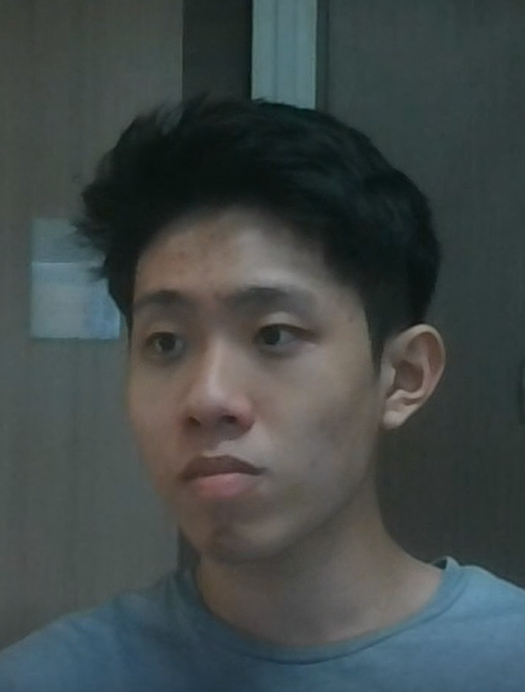
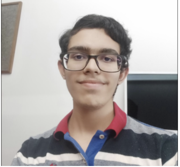
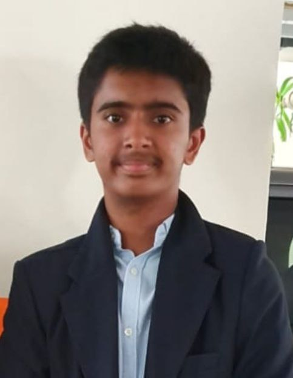

We are a team based in the [School of Computing, National University of Singapore](http://www.comp.nus.edu.sg).

You can reach us at the email `seer[at]comp.nus.edu.sg`

## Project team

### David Liu

[[github](https://github.com/kangxun)]
[[portfolio](team/kangxun.md)]

* Role: Project Advisor

### Pranav Ganesh

[[github](https://github.com/pranav-ganesh)]
[[portfolio](team/pranav-ganesh.md)]

* Role: Team Lead
* Responsibilities: UI

### Houten Teo

[[github](https://github.com/houtenteo)] 
[[portfolio](team/houtenteo.md)]

* Role: Developer
* Responsibilities: Data

### Irfan Danial

[[github](http://github.com/idgrr)]
[[portfolio](team/idgrr.md)]

* Role: Developer
* Responsibilities: Dev Ops + Threading

### Mulanur Subramanian Saketh

[[github](http://github.com/loose-bus-change)]
[[portfolio](team/loose-bus-change.md)]

* Role: Developer
* Responsibilities: UI/Add function
