* Table of Contents
{:toc}

--------------------------------------------------------------------------------------------------------------------

## **Introduction**

CallMeMaybe (CMM) is a **desktop app** centered for Telemarketers in aiding them in customer contact management.
CMM provides a solution to quickly catalog people based on who has/yet to be called.
The in-built tracking functionality serves as a reminder to reach back on previously unreachable customers.
Importing and exporting of existing customer database is also supported by CMM to facilitate team-based environments.

This Developer Guide (DG) aims to help developers better understand the architecture and design choices of CMM.

--------------------------------------------------------------------------------------------------------------------
## **Acknowledgements**

* CMM is adapted from AddressBook-Level3 (AB3)
* For the detailed documentation of AddressBook-Level3 project, see the Address Book Product Website
* Libraries used: JavaFX, Jackson, JUnit5

--------------------------------------------------------------------------------------------------------------------

## **Setting up, getting started**

Refer to the guide [_Setting up and getting started_](SettingUp.md).

--------------------------------------------------------------------------------------------------------------------

## **Design**

:bulb: **Tip:** The `.puml` files used to create diagrams in this document can be found in the [diagrams](https://github.com/se-edu/addressbook-level3/tree/master/docs/diagrams/) folder. Refer to the [_PlantUML Tutorial_ at se-edu/guides](https://se-education.org/guides/tutorials/plantUml.html) to learn how to create and edit diagrams.

### Architecture

The ***Architecture Diagram*** given above explains the high-level design of the App.

Given below is a quick overview of main components and how they interact with each other.

**Main components of the architecture**

**`Main`** has two classes called [`Main`](https://github.com/se-edu/addressbook-level3/tree/master/src/main/java/seedu/address/Main.java) and [`MainApp`](https://github.com/se-edu/addressbook-level3/tree/master/src/main/java/seedu/address/MainApp.java). It is responsible for,
* At app launch: Initializes the components in the correct sequence, and connects them up with each other.
* At shut down: Shuts down the components and invokes cleanup methods where necessary.

[**`Commons`**](#common-classes) represents a collection of classes used by multiple other components.

The rest of the App consists of four components.

* [**`UI`**](#ui-component): The UI of the App.
* [**`Logic`**](#logic-component): The command executor.
* [**`Model`**](#model-component): Holds the data of the App in memory.
* [**`Storage`**](#storage-component): Reads data from, and writes data to, the hard disk.

**How the architecture components interact with each other**

The *Sequence Diagram* below shows how the components interact with each other for the scenario where the user issues the command `delete 1`.

Each of the four main components (also shown in the diagram above),

* defines its *API* in an `interface` with the same name as the Component.
* implements its functionality using a concrete `{Component Name}Manager` class (which follows the corresponding API `interface` mentioned in the previous point.

For example, the `Logic` component defines its API in the `Logic.java` interface and implements its functionality using the `LogicManager.java` class which follows the `Logic` interface. Other components interact with a given component through its interface rather than the concrete class (reason: to prevent outside component's being coupled to the implementation of a component), as illustrated in the (partial) class diagram below.

The sections below give more details of each component.

### UI component

The **API** of this component is specified in [`Ui.java`](https://github.com/se-edu/addressbook-level3/tree/master/src/main/java/seedu/address/ui/Ui.java)

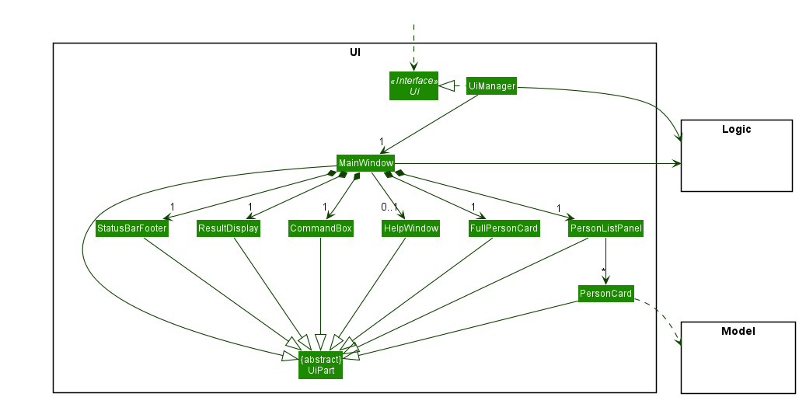

The UI consists of a `MainWindow` that is made up of parts e.g.`CommandBox`, `ResultDisplay`, `PersonListPanel`, `StatusBarFooter` etc. All these, including the `MainWindow`, inherit from the abstract `UiPart` class which captures the commonalities between classes that represent parts of the visible GUI.

The `UI` component uses the JavaFx UI framework. The layout of these UI parts are defined in matching `.fxml` files that are in the `src/main/resources/view` folder. For example, the layout of the [`MainWindow`](https://github.com/se-edu/addressbook-level3/tree/master/src/main/java/seedu/address/ui/MainWindow.java) is specified in [`MainWindow.fxml`](https://github.com/se-edu/addressbook-level3/tree/master/src/main/resources/view/MainWindow.fxml)

The `UI` component,

* executes user commands using the `Logic` component.
* listens for changes to `Model` data so that the UI can be updated with the modified data.
* keeps a reference to the `Logic` component, because the `UI` relies on the `Logic` to execute commands.
* depends on some classes in the `Model` component, as it displays `Person` object residing in the `Model`.

### Logic component

**API** : [`Logic.java`](https://github.com/se-edu/addressbook-level3/tree/master/src/main/java/seedu/address/logic/Logic.java)

Here's a (partial) class diagram of the `Logic` component:

How the `Logic` component works:
1. When `Logic` is called upon to execute a command, it uses the `AddressBookParser` class to parse the user command.
1. This results in a `Command` object (more precisely, an object of one of its subclasses e.g., `AddCommand`) which is executed by the `LogicManager`.
1. The command can communicate with the `Model` when it is executed (e.g. to add a contact).
1. The result of the command execution is encapsulated as a `CommandResult` object which is returned back from `Logic`.

The Sequence Diagram below illustrates the interactions within the `Logic` component for the `execute("delete 1")` API call.

:information_source: **Note:** The lifeline for `DeleteCommandParser` should end at the destroy marker (X) but due to a limitation of PlantUML, the lifeline reaches the end of diagram.

Here are the other classes in `Logic` (omitted from the class diagram of the `Logic` component above) that are used for parsing a user command:

How the parsing works:
* When called upon to parse a user command, the `AddressBookParser` class creates an `XYZCommandParser` (`XYZ` is a placeholder for the specific command name e.g., `AddCommandParser`) which uses the other classes shown above to parse the user command and create a `XYZCommand` object (e.g., `AddCommand`) which the `AddressBookParser` returns back as a `Command` object.
* All `XYZCommandParser` classes (e.g., `AddCommandParser`, `DeleteCommandParser`, ...) inherit from the `Parser` interface so that they can be treated similarly where possible e.g, during testing.

Additionally, here are other classes in `Logic` (omitted from the class diagram of the `Logic` component above) that are used for comparing `Person` objects which are part of the `Model` component:

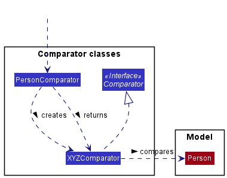

How the comparing works:
* When called upon to compare contacts, the `PersonComparator` class creates an `XYZComparator` (`XYZ` is a placeholder for the specific comparator name e.g., `GenderComparator`). The `PersonComparator` returns the `XYZComparator` object as a `Comparator` object.
* All `XYZComparator` classes (e.g., `GenderComparator`, `CalledComparator`, ...) inherit from the `Comparator` interface so that they can be treated similarly where possible e.g, during testing.

### Model component
**API** : [`Model.java`](https://github.com/se-edu/addressbook-level3/tree/master/src/main/java/seedu/address/model/Model.java)

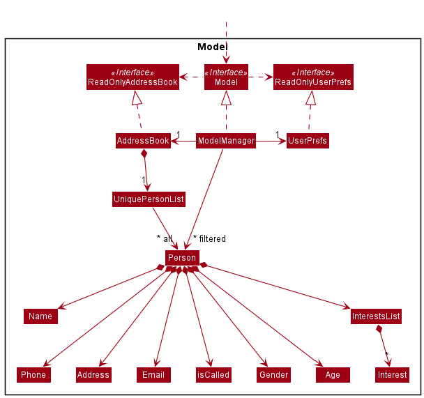

The `Model` component,

* stores the address book data i.e., all `Person` objects (which are contained in a `UniquePersonList` object).
* stores the currently 'selected' `Person` objects (e.g., results of a search query) as a separate _filtered_ list which is exposed to outsiders as an unmodifiable `ObservableList<Person>` that can be 'observed' e.g. the UI can be bound to this list so that the UI automatically updates when the data in the list change.
* stores a `UserPref` object that represents the user’s preferences. This is exposed to the outside as a `ReadOnlyUserPref` objects.
* does not depend on any of the other three components (as the `Model` represents data entities of the domain, they should make sense on their own without depending on other components)

:information_source: **Note:** An alternative (arguably, a more OOP) model is given below. It has an `Interest` list in the `AddressBook`, which `InterestsList` references. This allows `AddressBook` to only require one `Interest` object per unique interest, instead of each `InterestsList` needing their own `Interest` objects. 

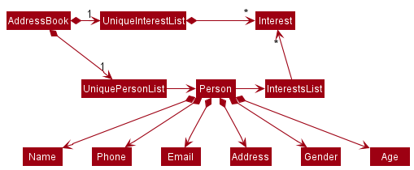

### Storage component

**API** : [`Storage.java`](https://github.com/se-edu/addressbook-level3/tree/master/src/main/java/seedu/address/storage/Storage.java)

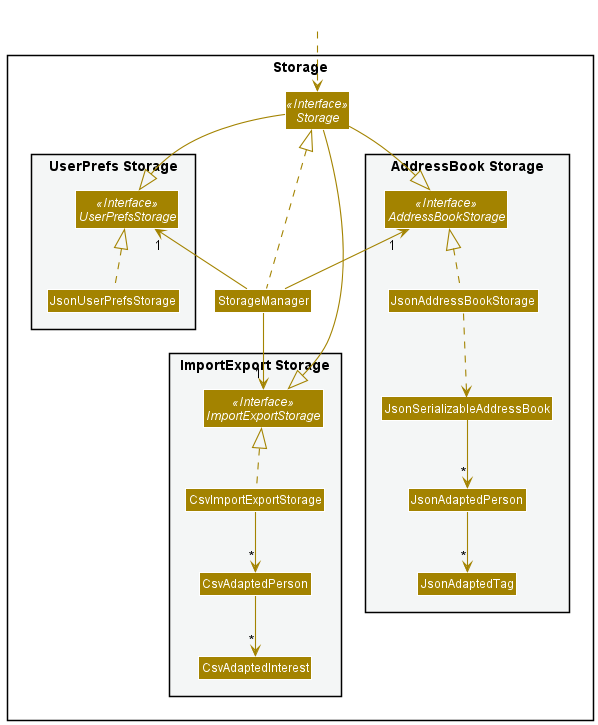

The `Storage` component,
* can save both address book data and user preference data in json format, and read them back into corresponding objects.
* can export and import into address book data in csv format, and read them back into corresponding objects.
* inherits from both `AddressBookStorage`, `UserPrefStorage` and `ImportExportStorage`, which means it can be treated as either one (if only the functionality of only one is needed).
* depends on some classes in the `Model` component (because the `Storage` component's job is to save/retrieve objects that belong to the `Model`)

### Common classes

Classes used by multiple components are in the `seedu.addressbook.commons` package.

--------------------------------------------------------------------------------------------------------------------

## **Implementation**

This section describes some noteworthy details on how certain features are implemented.

### Add feature

The add command is facilitated by the LogicManager.

**How the add command is executed:**

1. Command entered by user is passed into the LogicManager
2. AddressBookParser parses the command
3. AddressBookParser creates an AddCommand and a new Person with the fields specified by the user
4. LogicManager executes the AddCommand and the new Person is added into the address book

The Sequence Diagram below illustrates the interactions within the Logic component for the `execute("add n/bob e/email@email.com p/999")` API call.

:information_source: **Note:**
Due to the length of the arguments, we have decided to replace the line "n/bob e/email@email.com p/999"
with "..." within the diagram for easier viewing.

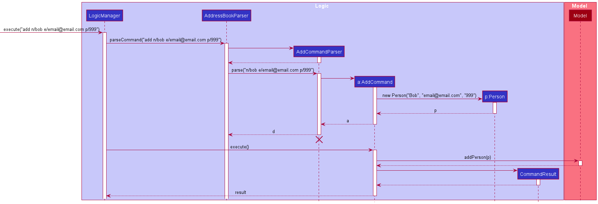

The activity diagram below summarises what happens when a user executes an Add Command.

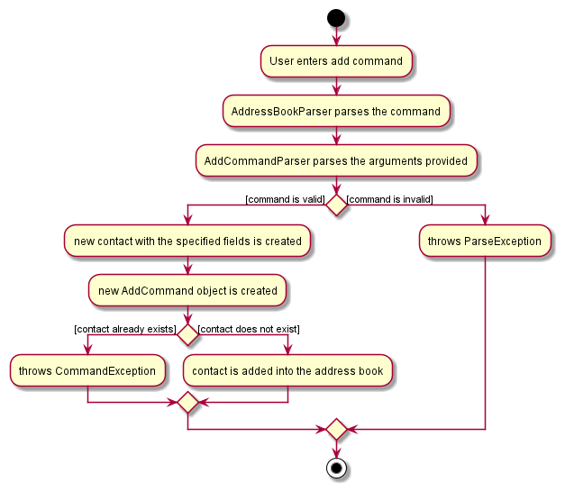

#### Design considerations:

**Aspect: Compulsory fields:**

* **Alternative 1 (current choice):** 3 compulsory fields
    * Compulsory fields: `Name`, `Email`, `Phone`.
    * Non-Compulsory fields: `Address`, `Gender`, `Age`, `Interest`.
    * Pros: Improves User Experience by minimising the number of fields the user is required to fill.
    * Cons: Slightly more complicated implementation.

* **Alternative 2:** All 7 fields are compulsory
    * Pros: Easier to implement.
    * Cons: Having to enter every field can be time-consuming for the user.

:information_source: **Note:** Since there is little reason for telemarketers to add a contact
who has already been called into the address book, all new contacts added will have their Called field set to false by default. Hence there
is no need for the user to specify the Called field.

As the app is catered towards telemarketers, the `Name`, `Email` and `Phone` fields were kept as compulsory as they are important contact information for telemarketers.

On the other hand, `Address`, `Gender`, `Age` and `Interest` are seen as complementary fields. Hence, they are non-compulsory.

The current split of compulsory and non-compulsory fields allows us to maintain the minimal amount of information required by telemarketers while
at the same time, improve user experience by reducing time required for users to type the command.

### FindAll/FindAny feature

The find commands are facilitated by the LogicManager.

**How the find command is executed:**

1. Command entered by user is passed into the LogicManager (ie. `findAny n/alex g/m` or `findAll n/alice g/f`)
2. AddressBookParser parses the command
3. AddressBookParser creates a FindAny/FindAll command with the respective predicates depending on the fields specified by the user
4. LogicManager executes the Find command and the model updates the filtered person list with the new predicates

The Sequence Diagram below illustrates the interactions within the Logic component for the `execute("n/alex")` API call.

:information_source: **Note:**
While only the findAny command was used for the examples below, the findAll command works exactly the same way

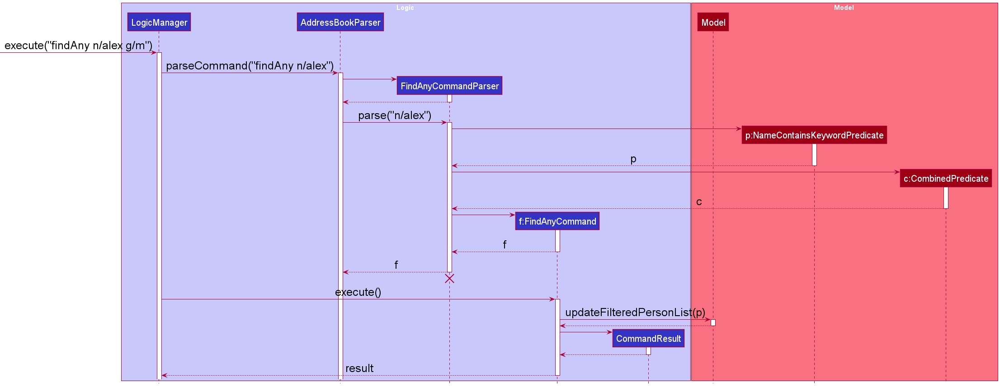

The activity diagram below summarises what happens when a user executes a `findAny` Command.

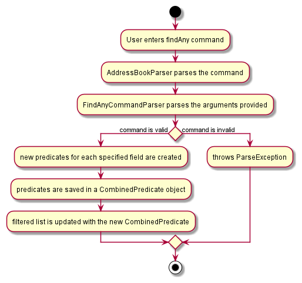

#### Design considerations:

**Aspect: Different types of find commands:**

`findAny`: A contact would be displayed as long as it matches any of the keywords specified by the user in its respective fields  
`findAll`: A contact would be displayed only if it matches **ALL** of the keywords specified by the user in its respective fields

* **Alternative 1 :** only findAny
    * Pros: Easier implementation
    * Cons: Users will not have a way to find contacts that fit a precise demographic

* **Alternative 2 (current choice):** Both findAny and findAll
    * Pros: Improves User Experience by giving users the freedom to decide whether they want find to be lenient or strict
    * Cons: More difficult to implement

As telemarketers, having the option to find specific demographics when selling products with very niche target audiences would
be invaluable. Therefore, although the usage rate of `findAll` may not be high while selling generic products. We cannot overlook
the event where the need arises.

### Display feature

The display command is facilitated by the LogicManager. The `LogicManager#execute()` executes the DisplayCommand
that it is passed from `DisplayCommandParser#parse()`. The `DisplayCommandParser#parse()` is used to parse the
command arguments in the context of DisplayCommand and returns a DisplayCommand object for execution.

This feature allows telemarketers to display additional details about a contact at any point in time
if they need to.

**Given below is an example usage scenario and how the display mechanism behaves at each step.**

1. The telemarketer opens the application and views the list of contacts. Then they want to view more details
about a particular contact. They enter the command `display 2`

2. Command entered by user is passed into the LogicManager which directs it to AddressBookParser

3. AddressBookParser parses the command

4. AddressBookParser creates a DisplayCommand with the index (i.e., 2) specified by the user

5. LogicManager executes the DisplayCommand and the contact to be displayed is obtained from the list of contacts

6. The UiManager then executes the displaying process by communicating with the MainWindow

   1. The MainWindow, where the relevant JavaFX elements are placed, shows the details of the selected contact

The following sequence diagram shows how the display operation works when the telemarketer enters `display 2`:

The following activity diagram summarizes what happens when a user executes a display command:

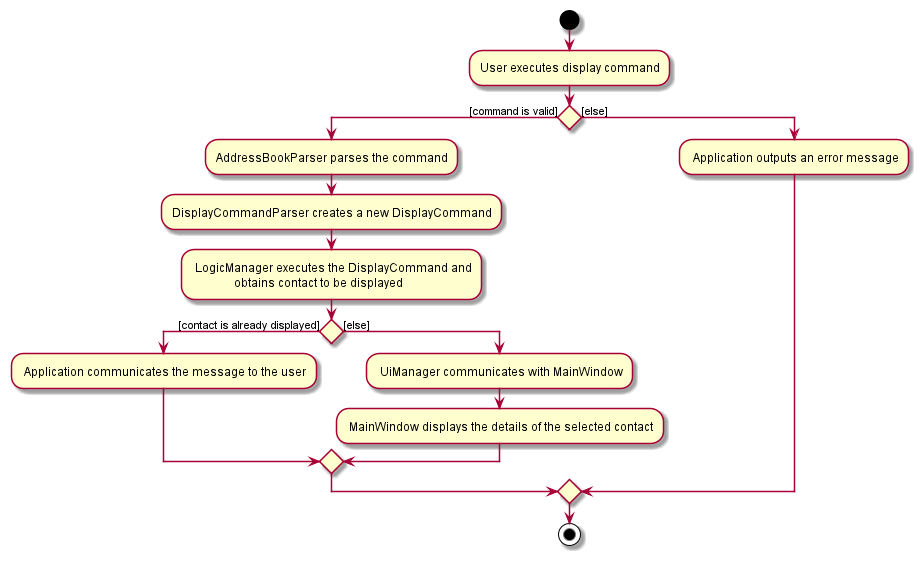

### Filter feature

The filter command is facilitated by the LogicManager.

**How the filter command is executed:**

1. Command entered by user is passed into the LogicManager
2. AddressBookParser parses the command
3. AddressBookParser creates a FilterCommand
4. LogicManager executes the FilterCommand and creates a Comparator with the category field specified by the user
5. The Comparator is used to sort the FilteredList of contacts in Model
6. The count field specified by the user is used to limit the number of contacts displayed in the GUI

The Sequence Diagram below illustrates the interactions within the Logic component for the execute("filter gender 3") API call.

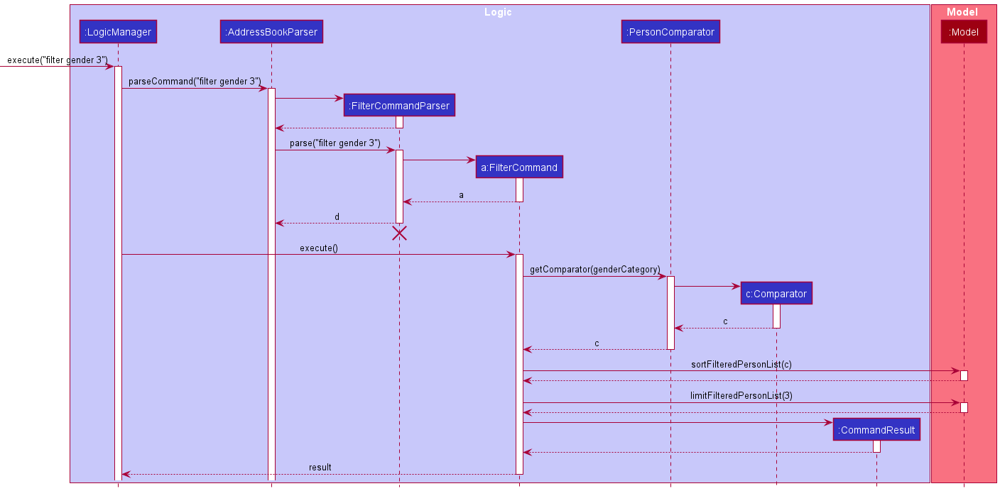

#### Design considerations:

**Aspect: Compulsory fields:**

* **Alternative 1 (current choice):** 1 compulsory field
    * Compulsory fields: `Category`.
    * Non-Compulsory fields: `Count`.
    * Pros: Allows quicker filtering by reducing the number of fields required.
    * Cons: More difficult to implement.

* **Alternative 2:** Both fields are compulsory
    * Pros: Easier to implement.
    * Cons: User has to choose how many contacts to be displayed every time.

:information_source: **Note:** Since there is little reason for telemarketers sort contacts
by categories other than "Gender" and "Called", those are the only categories supported by the filter command.

As the key intention is for users to filter by `Category`, it is kept as a compulsory field.

On the other hand, filtering by `Count` is a complementary feature to improve Quality of Life (QOL) for users. Hence, it is non-compulsory.

The current design implementation allows users to filter contacts quickly and gives the flexibility to further filter
the results if they ever want to.

### Edit feature

The edit mechanism is facilitated by `LogicManager` and `EditCommandParser`. `LogicManager#execute()` is used to execute the edit command
while the `EditCommandParser#parse()` is used to parse the command arguments in the context of EditCommand and returns an EditCommand object for execution.
This feature allows telemarketers to edit data fields at any point in time if they need to.

Given below is an example usage scenario and how the edit mechanism behaves at each step.

Step 1. The user launches the application and realizes that person 1 needs to be edited. He/she executes the command `edit 1 name/Will age/20` in order to edit the first person in the address book.

ℹ️ **Note:** If the user enters the command in an incorrect format, then an invalid command format message is displayed along with the correct format to use.

ℹ️ **Note:** Since the application strives to enhance a telemarketer's daily job, the `Name`, `Email` and `Phone` attributes are designed to be compulsory fields. These data
fields are essential contact information required by the telemarketers. The additional fields `Age`, `Gender`, `Address` and `InterestsList` are complimentary fields which enhance user
experience and accentuate the quality of the application.

Step 2. This command is passed on to the `LogicManager` which directs the command to the `AddressBookParser`.

Step 3. The `AddressBookParser` parses the command to extract all the arguments supplied by the telemarketer. It
returns an EditCommand along with a new person object (`new Person("Will", 20)`) containing all the data field values entered by the telemarketer.

Step 4. The `LogicManager` then executes the `EditCommand` which replaces the person at the specified index (1) with a new person object containing all the updated data fields.

ℹ️ **Note:** Editing of the `InterestsList` data field works slightly different from the rest of the fields. Telemarketers can specify an optional index to indicate which
item in the list they want to edit. `EditPersonDescriptor#editInterestList(InterestsList newInterestList, InterestsList currentInterestList)` parses
this index value. The item in that index is replaced with the newly edited item. If user doesn't specify any index, then the specified item is simply added to the `InterestsList`.

The following sequence diagram shows how the edit operation works when the telemarketer enters `edit 1 n/Peter e/peter@email.com g/M age/M`:

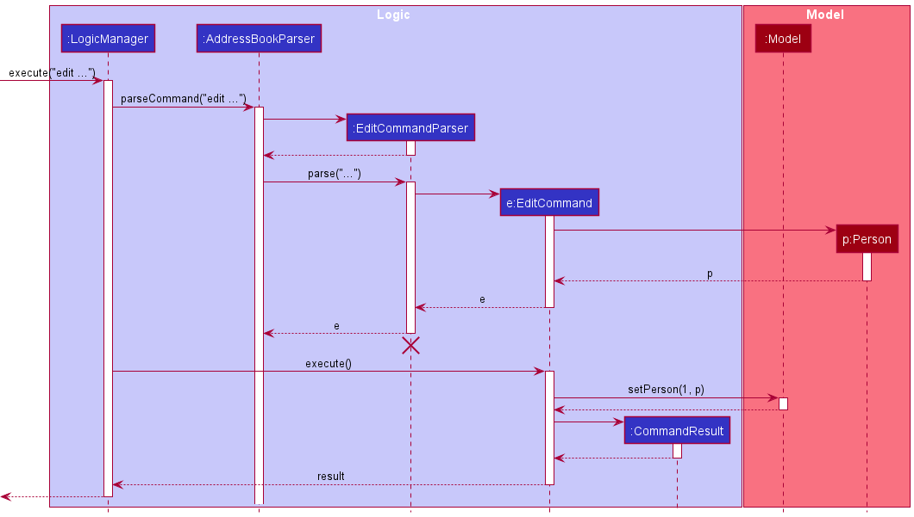

ℹ️ **Note:** The lifeline for `EditCommandParser` should end at the destroy marker (X) but due to a limitation of PlantUML, the lifeline reaches the end of diagram.

The following activity diagram summarizes what happens when a user executes an edit command:

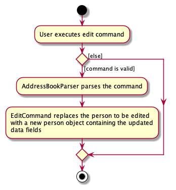

### Design considerations:

**Aspect: Compulsory fields:**

* **Alternative 1 (current choice):** 3 compulsory fields (`Name`, `Email` and `Phone`)

    * Pros: Enhance user experience since they don't need to waste time entering many data field values

    * Cons: More difficult to implement

* **Alternative 2:** All 7 fields compulsory (`Name`, `Email`, `Phone`, `Address`, `Age`, `Gender` and `Interestslist`)

    * Pros: Ensures consistency - All data fields of every contact is recorded, relatively simpler implementation.

    * Cons: Bad user experience as user will need to spend a lot of time filling every data field for all the contacts in the address book.

**Aspect: Edit command functionality:**

* **Alternative 1 (current choice):** Person to be edited is replaced by a new person object containing updated data field values

    * Pros: Easier to implement, more readable code and less prone to errors.

    * Cons: Every single time even if there is a minor edit, a new person object needs to be created which is not the most efficient mechanism for editing a person,
      potential overhead.

* **Alternative 2:** Person attributes are edited rather than the entire person object being replaced by a new object

    * Pros: Logically more apt and intuitive.

    * Cons: Implementation gets messy, violates the law of abstraction, and more prone to errors.

### Import feature

The import export feature primarily facilitated by the Storage Manager

**How the import is executed:**
1. MainWindow calls logic to import data
2. Logic calls StorageManager to import the data into a model
3. StorageManager calls CsvAddressBookImportExport to read and convert all details found in csv file to list of valid people
4. CsvAddressBookImportExport either adds or updates valid people into the model.
5. Logic saves the database after all imports have been completed

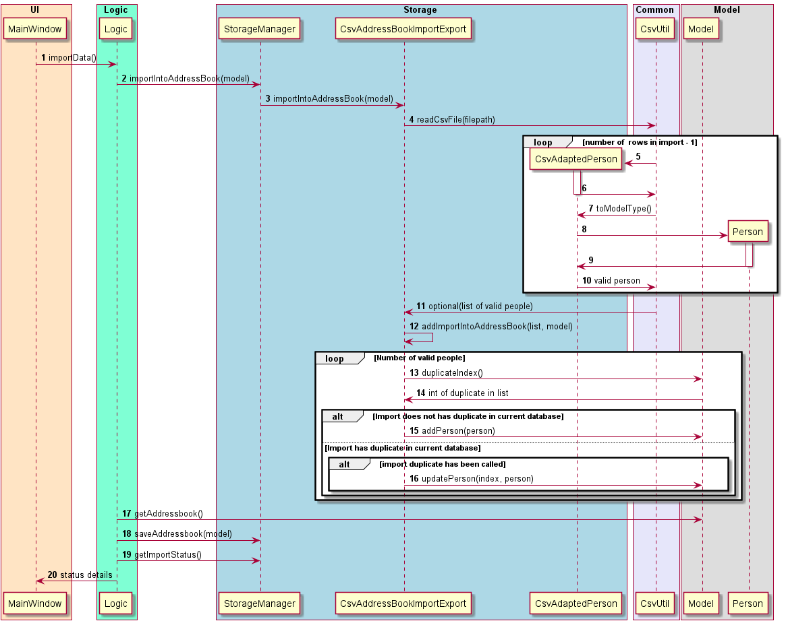

**Different Import settings based on User**

Application will ask whether the User has any new imports upon **every** application startup.  
User will be prompted with 3 options : 
* Add on Imports 
* Start new with imports
* No Imports. 

The following activity diagram summarizes what happens when a user selects either of the 3 options:
  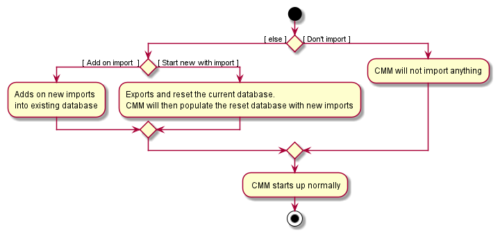

Next few sections will go deeper what CMM does in each case

#### Add On Imports
- Adds on new valid imports into existing database
    - Valid people need to have the following attributes : Name, Phone, Email filled
    - Every attribute of import person has to follow the type requirements. This is handled in CsvUtil and  CsvAdaptedPerson
- Duplicates found in database
    - As duplicates are often found when adding on to an existing database, it is important to have a clearly defined plan for CMM to handle such cases.  
The following activity diagram summarizes what happens when a duplicate import is encountered:  
      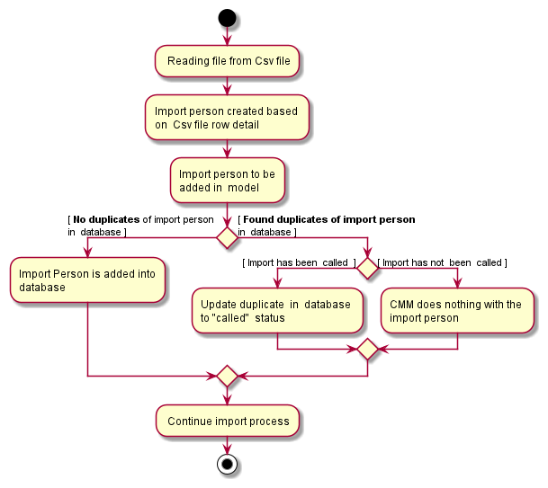

:information_source: **Note:**
Duplicates are defined to be two contacts with the exact same name, phone number and email address.

#### Start New Using Imports
- Exports the current state of the database into a CSV file. Export implementation is covered in detail [here](#export-feature).
- Replaces the current database with valid imports from the existing import.csv file

#### No imports
- CMM will not import anything and application will start normally
- Closing the prompt will also choose this option

:exclamation: **Caution:**  
This import will not work if the first row does not have valid headers.  
Headers must include `Name`, `Phone`, `Email`, `Address`, `Gender`, `Age`, `Interest` and `Called` from the left to right, 
starting from the cell 'A1'.   
Headers are not case sensitive

### Export feature
**How the export is executed:**
1. MainWindow calls Logic to Export data
2. Logic calls StorageManager to export the data found in model
3. StorageManager calls CsvImportExportStorage to read and convert to Csv file
4. Logic then saves the database after all contacts have been exported

:bulb: **Tip:**  
Export file will have the following file name : `export[Date HH:MM:SS].csv` where date and time will follow your system settings

#### Design considerations:

**Aspect: When import and export should be executed:**

* **Alternative 1 (current choice):** Always ask for import/export upon startup/exit
    * Pros: Ensures that user will always be using the most updated list. This reduces the likelihood of time wasted working on outdated data.
    * Cons: Popups may become annoying if user constantly opens and closes application

* **Alternative 2:** Separate command to import
  itself.
    * Pros: Less prompts upon startup. User can import while CMM is running
    * Cons: User may have forgotten to import the latest excel file and work on a file that was outdated, this will make the user waste a lot of time.

**Aspect: Types of imports that should be available to users:**

* **Alternative 1 (current choice):** 3 options : `Add on import` , `Start new with import`, `Don't import`
  * Pros: Provide variety of options of imports. CMM will cater to more tasks
  * Cons: More difficult to implement

* **Alternative 2:** Only allow 2 options : `Add on import` and `dont import`
  itself.
  * Pros: Easier to implement
  * Cons: Less flexibility for users

### \[Proposed\] Undo/redo feature

#### Proposed Implementation

The proposed undo/redo mechanism is facilitated by `VersionedAddressBook`. It extends `AddressBook` with an undo/redo history, stored internally as an `addressBookStateList` and `currentStatePointer`. Additionally, it implements the following operations:

* `VersionedAddressBook#commit()` — Saves the current address book state in its history.
* `VersionedAddressBook#undo()` — Restores the previous address book state from its history.
* `VersionedAddressBook#redo()` — Restores a previously undone address book state from its history.

These operations are exposed in the `Model` interface as `Model#commitAddressBook()`, `Model#undoAddressBook()` and `Model#redoAddressBook()` respectively.

Given below is an example usage scenario and how the undo/redo mechanism behaves at each step.

Step 1. The user launches the application for the first time. The `VersionedAddressBook` will be initialized with the initial address book state, and the `currentStatePointer` pointing to that single address book state.

Step 2. The user executes `delete 5` command to delete the 5th contact in the address book. The `delete` command calls `Model#commitAddressBook()`, causing the modified state of the address book after the `delete 5` command executes to be saved in the `addressBookStateList`, and the `currentStatePointer` is shifted to the newly inserted address book state.

Step 3. The user executes `add n/David …​` to add a new contact. The `add` command also calls `Model#commitAddressBook()`, causing another modified address book state to be saved into the `addressBookStateList`.

:information_source: **Note:** If a command fails its execution, it will not call `Model#commitAddressBook()`, so the address book state will not be saved into the `addressBookStateList`.

Step 4. The user now decides that adding the contact was a mistake, and decides to undo that action by executing the `undo` command. The `undo` command will call `Model#undoAddressBook()`, which will shift the `currentStatePointer` once to the left, pointing it to the previous address book state, and restores the address book to that state.

:information_source: **Note:** If the `currentStatePointer` is at index 0, pointing to the initial AddressBook state, then there are no previous AddressBook states to restore. The `undo` command uses `Model#canUndoAddressBook()` to check if this is the case. If so, it will return an error to the user rather
than attempting to perform the undo.

The following sequence diagram shows how the undo operation works:

:information_source: **Note:** The lifeline for `UndoCommand` should end at the destroy marker (X) but due to a limitation of PlantUML, the lifeline reaches the end of diagram.

The `redo` command does the opposite — it calls `Model#redoAddressBook()`, which shifts the `currentStatePointer` once to the right, pointing to the previously undone state, and restores the address book to that state.

:information_source: **Note:** If the `currentStatePointer` is at index `addressBookStateList.size() - 1`, pointing to the latest address book state, then there are no undone AddressBook states to restore. The `redo` command uses `Model#canRedoAddressBook()` to check if this is the case. If so, it will return an error to the user rather than attempting to perform the redo.

Step 5. The user then decides to execute the command `list`. Commands that do not modify the address book, such as `list`, will usually not call `Model#commitAddressBook()`, `Model#undoAddressBook()` or `Model#redoAddressBook()`. Thus, the `addressBookStateList` remains unchanged.

Step 6. The user executes `clear`, which calls `Model#commitAddressBook()`. Since the `currentStatePointer` is not pointing at the end of the `addressBookStateList`, all address book states after the `currentStatePointer` will be purged. Reason: It no longer makes sense to redo the `add n/David …​` command. This is the behavior that most modern desktop applications follow.

The following activity diagram summarizes what happens when a user executes a new command:

#### Design considerations:

**Aspect: How undo & redo executes:**

* **Alternative 1 (current choice):** Saves the entire address book.
  * Pros: Easy to implement.
  * Cons: May have performance issues in terms of memory usage.

* **Alternative 2:** Individual command knows how to undo/redo by
  itself.
  * Pros: Will use less memory (e.g. for `delete`, just save the contact being deleted).
  * Cons: We must ensure that the implementation of each individual command are correct.

_{more aspects and alternatives to be added}_

--------------------------------------------------------------------------------------------------------------------

## **Documentation, logging, testing, configuration, dev-ops** 

Here are some guides that you may find useful.

* [Documentation guide](Documentation.md)
* [Testing guide](Testing.md)
* [Logging guide](Logging.md)
* [Configuration guide](Configuration.md)
* [DevOps guide](DevOps.md)

--------------------------------------------------------------------------------------------------------------------

## **Appendix: Requirements**

### Product scope

**Target user profile**:

* Telemarketers
* has the potential to receive a list of clients through an Excel file
* prefer desktop apps over other types
* can type fast
* prefers typing to mouse interactions
* is reasonably comfortable using CLI apps

**Value proposition**: manage potentially interested clients faster than a typical mouse/ GUI driven app

### User stories

Priorities: High (must have) - `* * *`, Medium (nice to have) - `* *`, Low (unlikely to have) - `*`

| Priority | As a …​                                  | I want to …​                | So that I can…​                                                         |
| -------- | ------------------------------------------- | ------------------------------ | -------------------------------------------------------------------------- |
| `* * *`  | new user                                    | see usage instructions         | refer to instructions when I forget how to use the App                     |
| `* * *`  | Telemarketer                                | import data from an excel file | work on the list of contacts that was  set for me by my manager            |
| `* * *`  | Telemarketer                                | export data to an excel file   | return updated list of called contacts to my manager at the end of the day |
| `* * *`  | user                                        | add a new person               |                                                                            |
| `* * *`  | user                                        | delete a person                | remove entries that I no longer need                                       |
| `* * *`  | user                                        | display a person               | display additional details about a particular contact                      |
| `* * *`  | user                                        | find a person by name          | locate details of persons without having to go through the entire list     |
| `* *`    | user                                        | hide private contact details   | minimize chance of someone else seeing them by accident                    |
| `*`      | user with many contacts in the address book | filter contacts                | locate contacts who have not been called quickly                           |

### Use cases

(For all use cases below, the **System** is `CallMeMaybe` and the **Actor** is the `user`, unless specified otherwise)

**Use Case 1: Add a contact**

System : CallMeMaybe (CMM)  
Use Case : UC1 - Add a contact  
Actor : User  
Guarantees: New contact will be added to the address book

**MSS**

1. User requests to add a contact
2. Contact gets added into the address book

    Use case ends.

**Extensions**

* 1a. User enters the command wrongly

  * 1a1. Command box displays error message

    Use case resumes at step 1

**Use Case 2: List contacts**

System : CallMeMaybe (CMM)  
Use Case : UC2 - List contacts  
Actor : User  
Guarantees: Contacts in the address book will be listed

**MSS**

1. User requests to list contacts
2. All contacts in the address book is listed

    Use case ends

**Extensions**

* 1a. Address book is empty

    Use case ends

**Use Case 3: Delete a contact**

System : CallMeMaybe (CMM)  
Use Case : UC3 - Delete a contact  
Actor : User  
Guarantees: Selected contact will be deleted from the address book

**MSS**

1. User requests to list contacts (UC2)
2. User requests to delete a specific contact in the list
3. AddressBook deletes the contact

    Use case ends.

**Extensions**

* 1a. The list is empty.

  Use case ends.

* 2a. The given index is invalid.

    * 2a1. AddressBook shows an error message.

      Use case resumes at step 2.

**Use Case 4: Mark a contact as called**

System : CallMeMaybe (CMM)  
Use Case : UC4 - Mark contact as called  
Actor : User  
Guarantees: Selected contact will be marked as called

**MSS**

1. User requests to list contacts (UC2)
2. User requests to mark a contact as called
3. Address book marks the selected contact as called

**Extensions**

* 1a. List is empty

  Use case ends

* 2a. The given index is invalid

  * 2a1. Address book shows an error message

    Use case resumes at step 2

**Use Case 5: Using an Excel file to import data of users**

System : CallMeMaybe (CMM)  
Use Case : UC5 - Import Excel File  
Actor : User  
Guarantees: CMM Database will be set

**MSS**

2. CMM ask whether to start creation new Database using import data or insert into existing database, upon startup
3. User determines import setting
4. CMM imports the file
   Use case ends.

**Extensions**

* 1a. User does not want to import any new data
    * 1a1. CMM runs as per normal

* 2a. User request to create a new Database when CMM has no existing database
    * 2a1 CMM will convert the excel file to the correct datatype to be stored inside CMM

* 2b. User request to create a new Database when CMM has existing database
    * 2c1 CMM exports the current database (UC6)
    * 2c2 CMM clears the current database
    * 2c3 CMM will convert the excel file to the correct datatype to be stored inside CMM

* 2c. User request to add on to current Database when CMM has existing database
    * 2d1 CMM will convert the excel file to the correct datatype to be stored inside CMM
    * 2d2 CMM adds on to current database

* 2d. User request to add on to current Database when CMM has no existing database
    * 2e1 CMM will convert the excel file to the correct datatype to be stored inside CMM
    * 2e2 CMM creates new database
    * 2e3 CMM adds on to current database

* 4a. During import, User uses a file that does not exist
    * 5a1. CMM will cancel the transfer
    * 5a2. CMM informs the user of the cancellation

* 4a. During import, User uses a file that does not follow the set format
    * 6a1. CMM will cancel the transfer
    * 6a2. CMM informs the user of the cancellation

* *a. At any time before import confirmation, User chooses to cancel the transfer.
    * *a1. CMM will stop all import operation
    * *a3. No changes are made in CMM Database
    * *a4. CMM starts as per normal

**Use Case 6: Exporting current database into excel file**

System : CallMeMaybe (CMM)  
Use Case : UC6 - Export database as Excel File  
Actor : User  
Guarantees: Excel file export of current database

MSS:
1. User request CMM to export database into excel file
2. CMM exports database into excel file to a CMM-specified location
   Use case ends.

**Use Case 7: Displaying additional details about a person**

System : CallMeMaybe (CMM)  
Use Case : UC7 - Display a person  
Actor : User  
Guarantees: Selected person's additional details will be displayed

**MSS**

1. User requests to list persons (UC2)
2. User requests to display a specific person in the list
3. Application displays the person in a new window

* 1a. The list is empty.

  Use case ends.

* 2a. The given index is invalid.

    * 2a1. AddressBook shows an error message.

      Use case resumes at step 2.

* 2b. The selected person is already being displayed

    * 2b1. Application shows a message saying the person is already being displayed

      Use case resumes at step 2.

**Use Case 8: Filter contacts**

System : CallMeMaybe (CMM)  
Use Case : UC8 - Filter contacts  
Actor : User  
Guarantees: Contacts will be sorted by category specified

**MSS**

1. User requests to filter contacts
2. Contacts be filtered based on the fields specified by the user.

   Use case ends.

**Extensions**

* 1a. User enters the command wrongly

    * 1a1. Command box displays error message

      Use case resumes at step 1

* 1b. User enters an invalid field

    * 1b1. Command box displays error message

      Use case resumes at step 1

**Use Case 9: Finding specific contacts**

System : CallMeMaybe (CMM)  
Use Case : UC9 - Finding specific contacts  
Actor : User  
Guarantees: All contacts that match the specified fields would be displayed

**MSS**

1. User requests to find contacts
2. Only the contacts the match the keywords specified are displayed

   Use case ends.

**Extensions**

* 1a. User enters the command wrongly

    * 1a1. Command box displays error message

      Use case resumes at step 1

* 1b. User enters an invalid field

    * 1b1. Command box displays error message

      Use case resumes at step 1

### Non-Functional Requirements

1. Should work on any _mainstream OS_ as long as it has Java `11` or above installed.
2. Should be able to hold up to 1000 contacts without a noticeable sluggishness in performance for typical usage.
3. A user with above average typing speed for regular English text (i.e. not code, not system admin commands) should be able to accomplish most of the tasks faster using commands than using the mouse.
4. Portability of database is expected as Telemarketers tend to work in a team setting.
5. A user should be able to retrieve the latest list of contacts in the event the program crashes unexpectedly.
6. Each command should not take more to 1 second to execute.

### Glossary

* **CLI**: Command Line Interface
* **CMM**: CallMeMaybe, the name of the application
* **GUI**: Graphical User Interface
* **Mainstream OS**: Windows, Linux, Unix, OS-X
* **Private contact detail**: A contact detail that is not meant to be shared with others
* **CSV Comma Separated Values**: An excel format
* **PlantUML**: An open-source tool allowing users to create diagrams from a plain text language
* **JSON**: JSON is an open standard file format and data interchange format that uses human-readable text to store and transmit data objects consisting of attribute–value pairs and arrays.
* **Quality of Life**: The measure of how convenient it is to use an application
--------------------------------------------------------------------------------------------------------------------

## **Appendix: Instructions for manual testing**

Given below are instructions to test the app manually.

:information_source: **Note:** These instructions only provide a starting point for testers to work on;
testers are expected to do more *exploratory* testing.

### Launch and shutdown

1. Initial launch

   1. Download the jar file and copy into an empty folder

   2. Double-click the jar file Expected: Shows the GUI with a set of sample contacts. The window size may not be optimum.
  
  
2. Importing Data
    1. Test Add on import
        1. Prerequisites : Data in CMM is currently populated and import.csv in the correct format at the correct file location
        1. Testcase : click `Add on Import` upon CMM startup  
           Expected : Valid people in import.csv are added on to existing data in CMM
    1. Test Start using New Import
        1. Prerequisites : Data in CMM is currently populated and import.csv in the correct format at the correct file location
        1. Testcase : click `Start using New Import` upon CMM startup  
           Expected : Current data is exported in a csv file. Only valid people in import.csv exists in CMM
   1. Test Don't Import
       1. Prerequisites : Data in CMM is currently populated and import.csv in the correct format at the correct file location
       1. Testcase : click `Don't import` upon CMM startup or close the prompt  
          Expected : Current data will stay in CMM. No new data will be imported
  

3. Exporting Data
    1. Test exporting
        1. Testcase : click `Export` upon CMM shutdown 
          Expected : new csv file with the latest details can be found in the data folder at CMM jar location
   2. Test Don't exporting
      1. Testcase : click `Don't export` or close the prompt 
          Expected: No new csv files created.

### Deleting a contact

1. Deleting a contact while all contacts are being shown

   1. Prerequisites: List all contacts using the `list` command. Multiple contacts in the list.

   2. Test case: `delete 1` 
      Expected: First contact is deleted from the list. Details of the deleted contact shown in the status message. Timestamp in the status bar is updated.

   3. Test case: `delete 0` 
      Expected: No contact is deleted. Error details shown in the status message. Status bar remains the same.

   4. Other incorrect delete commands to try: `delete`, `delete x`, `...` (where x is larger than the list size) 
      Expected: Similar to previous.

### Displaying a person

1. Displaying a contact while all contacts are being shown

    1. Prerequisites: List all persons using the `list` command.

    1. Test case: `display 2` 
        Expected: Second contact is displayed from the list.

    1. Test case: `display 0` 
       Expected: The default contact (i.e, first contact) is displayed. Error details shown in the status message.

    1. Other incorrect delete commands to try: `display`, `display x` (where x is larger than the list size) 
       Expected: Similar to previous.

### Filtering contacts

1. Filtering all contacts

    1. Test case: `filter gender` 
       Expected: All contacts are displayed, sorted by gender.

    2. Test case: `filter called 1` 
       Expected: Sort contacts based on whether they are called. Only the first contact is displayed.

    3. Test case: `filter called 0` 
       Expected: Contacts are not filtered. Error details shown in the status message. Status bar remains the same.

    4. Test case: `filter address 0` 
       Expected: Contacts are not filtered. Error details shown in the status message. Status bar remains the same.

    5. Other incorrect delete commands to try: `filter`, `filter x` (where x is an invalid category),
       `filter y z`,`...` (where y is a valid category but z is less than or equal to zero) 
       Expected: Similar to previous.

### Adding contacts

1. Adding valid contacts with only the 3 compulsory fields, `name`, `phone`, `email` specified
   * Test case: `add n/bob p/98765432 e/test@test.com` 
   Expected: A contact with the specified fields is added into the list with all other fields, `address`, `age`, `gender`, `interests` left as 'N.A'
   
2. Adding valid contacts with multiple optional fields specified
   * Test case: `add n/bob p/98765432 e/test@test.com g/m i/running`
   Expected: A contact with the specified fields is added into the list with only `address` and `age` left as 'N.A'
   * Test case: `add n/bob p/98765432 e/test@test.com a/his house age/22`
   Expected: A contact with the specified fields is added into the list with only `gender` and `interests` left as 'N.A'

3. Adding contacts with invalid fields
   * Test case: `add n/bob p/18765432 e/test@test.com g/m i/running` (phone is invalid)
   Expected: Application shows an "Invalid command format message" in the feedback box
   * Test case: `add n/bob p/98765432 e/test@test.com g/me i/running` (gender is invalid)
   Expected: Application shows an "Invalid command format message" in the feedback box

4. Adding contacts without anything specified after the prefix
  * Test case: `add n/bob p/18765432 e/test@test.com g/m i/` ('i/' is left empty)
    Expected: Application shows an "Invalid command format message" in the feedback box
  * Test case: `add n/bob p/18765432 e/test@test.com g/ i/running` ('g/' is left empty)
    Expected: Application shows an "Invalid command format message" in the feedback box

### Finding contacts

:information_source: **Note:** The test cases below only make use of the findAny command. 
However, the findAll command should be tested roughly the same way. Only difference is when multiple valid fields are supplied at once.

1. Finding contacts that have a certain substring in their name
   * Test case: `findAny n/bob`
   Expected: Only contacts that have the substring 'bob' in their name are displayed

2. Finding contacts that have a certain interest
   * Test case `findAny i/run`
   Expected: Only contacts that have the substring 'run' in any of their interests are displayed

3. Finding contacts with multiple specified fields
   * Test case `findAny n/bob i/run`
     Expected: Only contacts that have either the substring 'bob' in their name or 'run' in any of their interests are displayed 
     (For findAll: Only contacts that have both the substring 'bob' in their name and 'run' in any of their interests are displayed )

4. Finding contacts with invalid fields
   * Test case: `findAny g/helicopter`
   Expected: Application shows an "Invalid command format message" in the feedback box

5. Finding contacts that do not exist in the database
   * Test case: `findAny n/[any substring that does not exist]`
   Expected: No contacts are displayed

### Saving data

1. Dealing with missing/corrupted data files

   1. _{explain how to simulate a missing/corrupted file, and the expected behavior}_

1. _{ more test cases …​ }_
