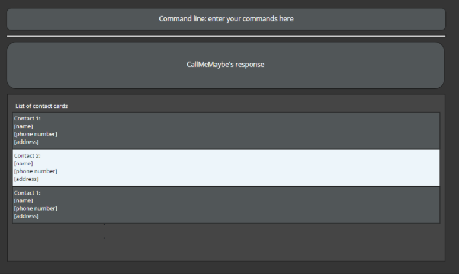
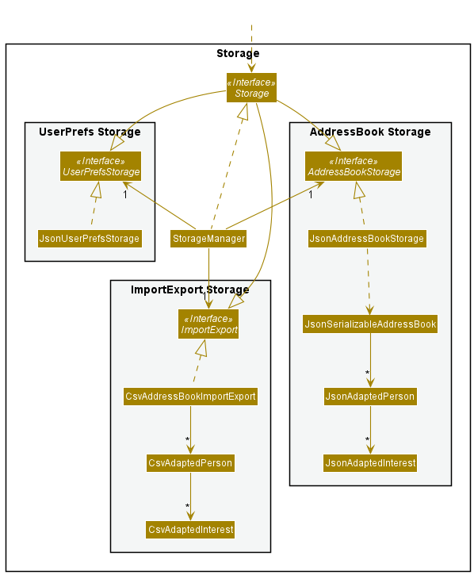
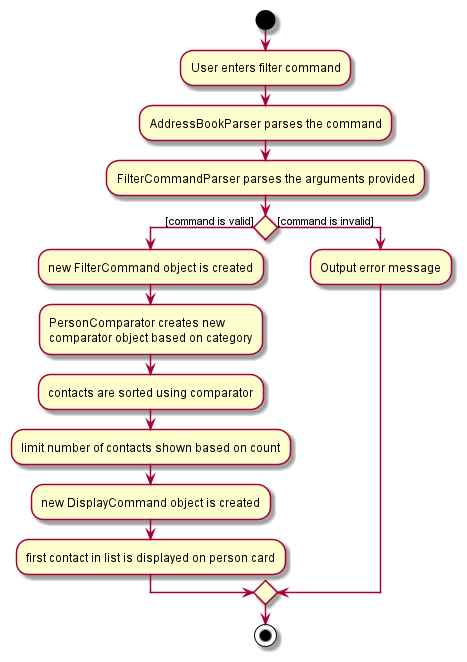

* Table of Contents
{:toc}

--------------------------------------------------------------------------------------------------------------------

## **Introduction**

CallMeMaybe (CMM) is a **desktop app** that helps Telemarketers in customer contact management.
CMM provides a solution to quickly catalog contacts based on whether they have already been called or not.
The in-built tracking functionality serves as a reminder to reach back on previously unreachable customers.
Importing and exporting of existing customer database is also supported by CMM to facilitate team-based environments.

This Developer Guide (DG) aims to help developers better understand the architecture and design choices of CMM.

The screenshot below shows the different components of the Ui. It would be helpful to take note of the different components
as there will be references to these Ui components throughout this Developer Guide

--------------------------------------------------------------------------------------------------------------------
## **Acknowledgements**

* CMM is adapted from AddressBook-Level3 (AB3)
* For the detailed documentation of AddressBook-Level3 project, see the [Address Book Product Website](https://se-education.org/addressbook-level3/)
* Libraries used: JavaFX, Jackson, JUnit5

--------------------------------------------------------------------------------------------------------------------

## **Setting up, getting started**

Refer to the guide [_Setting up and getting started_](SettingUp.md).

--------------------------------------------------------------------------------------------------------------------

## **Design**

:bulb: **Tip:** The `.puml` files used to create diagrams in this document can be found in the [diagrams](https://github.com/AY2122S1-CS2103T-T13-4/tp/tree/master/docs/diagrams) folder. Refer to the [_PlantUML Tutorial_ at se-edu/guides](https://se-education.org/guides/tutorials/plantUml.html) to learn how to create and edit diagrams.

### Architecture

The ***Architecture Diagram*** given above explains the high-level design of the App.

Given below is a quick overview of the main components and how they interact with each other.

**Main components of the architecture**

**`Main`** has two classes called [`Main`](https://github.com/AY2122S1-CS2103T-T13-4/tp/blob/master/src/main/java/seedu/address/Main.java) and [`MainApp`](https://github.com/AY2122S1-CS2103T-T13-4/tp/blob/master/src/main/java/seedu/address/MainApp.java). They are responsible for:

* At app launch: Initializes the components in the correct sequence, and connects them up with each other.

* At shut down: Shuts down the components and invokes cleanup methods where necessary.

[**`Commons`**](#common-classes) represents a collection of classes used by multiple other components.

The rest of the App consists of four components.

* [**`UI`**](#ui-component): The UI of the App.

* [**`Logic`**](#logic-component): The command executor.

* [**`Model`**](#model-component): Holds the data of the App in memory.

* [**`Storage`**](#storage-component): Reads data from, and writes data to, the hard disk.

**How the architecture components interact with each other**

The *Sequence Diagram* below shows how the components interact with each other for the scenario where the user issues the command `delete 1`.

Each of the four main components (also shown in the diagram above),

* defines its *API* in an `interface` with the same name as the Component.

* implements its functionality using a concrete `{Component Name}Manager` class (which follows the corresponding API `interface` mentioned in the previous point.

For example, the `Logic` component defines its API in the `Logic.java` interface and implements its functionality using the `LogicManager.java` class which follows the `Logic` interface. Other components interact with a given component through its interface rather than the concrete class (reason: to prevent outside component's being coupled to the implementation of a component), as illustrated in the (partial) class diagram below.

The sections below give more details of each component.

### UI component

The **API** of this component is specified in [`Ui.java`](https://github.com/AY2122S1-CS2103T-T13-4/tp/blob/master/src/main/java/seedu/address/ui/Ui.java)

The UI consists of a `MainWindow` that is made up of parts e.g.`CommandBox`, `ResultDisplay`, `PersonListPanel`, `StatusBarFooter` etc. All these, including the `MainWindow`, inherit from the abstract `UiPart` class which captures the commonalities between classes that represent parts of the visible GUI.

The `UI` component uses the JavaFx UI framework. The layout of these UI parts are defined in matching `.fxml` files that are in the `src/main/resources/view` folder. 
For example, the layout of the [`MainWindow`](https://github.com/AY2122S1-CS2103T-T13-4/tp/blob/master/src/main/java/seedu/address/ui/MainWindow.java) 
is specified in [`MainWindow.fxml`](https://github.com/AY2122S1-CS2103T-T13-4/tp/blob/master/src/main/resources/view/MainWindow.fxml)

The `UI` component,

* executes user commands using the `Logic` component.

* listens for changes to `Model` data so that the UI can be updated with the modified data.

* keeps a reference to the `Logic` component, because the `UI` relies on the `Logic` to execute commands.

* depends on some classes in the `Model` component, as it displays `Person` object residing in the `Model`.

### Logic component

**API** : [`Logic.java`](https://github.com/AY2122S1-CS2103T-T13-4/tp/blob/master/src/main/java/seedu/address/logic/Logic.java)

Here's a (partial) class diagram of the `Logic` component:

How the `Logic` component works:
1. When `Logic` is called upon to execute a command, it uses the `AddressBookParser` class to parse the user command.

2. This results in a `Command` object (more precisely, an object of one of its subclasses e.g., `AddCommand`) which is executed by the `LogicManager`.

3. The command can communicate with the `Model` when it is executed (e.g. to add a contact).

4. The result of the command execution is encapsulated as a `CommandResult` object which is returned back from `Logic`.

The Sequence Diagram below illustrates the interactions within the `Logic` component for the `execute("delete 1")` API call.

:information_source:

**Note:** 
The lifeline for `DeleteCommandParser` should end at the destroy marker (X) but due to a limitation of PlantUML, the lifeline reaches the end of diagram.

Here are the other classes in `Logic` (omitted from the class diagram of the `Logic` component above) that are used for parsing a user command:

How the parsing works:

* When called upon to parse a user command, the `AddressBookParser` class creates an `XYZCommandParser` 
(`XYZ` is a placeholder for the specific command name e.g., `AddCommandParser`) which uses the other classes shown above to parse the user command 
and create a `XYZCommand` object (e.g., `AddCommand`) which the `AddressBookParser` returns back as a `Command` object.

* All `XYZCommandParser` classes (e.g., `AddCommandParser`, `DeleteCommandParser`, ...) inherit from the `Parser` interface so that they can be treated similarly where possible e.g, during testing.

Additionally, here are other classes in `Logic` (omitted from the class diagram of the `Logic` component above) that are used for comparing `Person` objects which are part of the `Model` component:

How the comparing works:
* When called upon to compare contacts, the `PersonComparator` class creates an `XYZComparator` 
(`XYZ` is a placeholder for the specific comparator name e.g., `GenderComparator`). The `PersonComparator` returns the `XYZComparator` object as a `Comparator` object.

* All `XYZComparator` classes (e.g., `GenderComparator`, `CalledComparator`, ...) inherit from the `Comparator` interface so that they can be treated similarly where possible e.g, during testing.

### Model component
**API** : [`Model.java`](https://github.com/AY2122S1-CS2103T-T13-4/tp/blob/master/src/main/java/seedu/address/model/Model.java)

The `Model` component,

* stores the address book data i.e., all `Person` objects (which are contained in a `UniquePersonList` object).

* stores the currently 'selected' `Person` objects (e.g., results of a search query) as a separate _filtered_ list which is exposed to outsiders 
as an unmodifiable `ObservableList<Person>` that can be 'observed' e.g. the UI can be bound to this list so that the UI automatically updates when 
the data in the list change.

* stores a `UserPref` object that represents the user’s preferences. This is exposed to the outside as a `ReadOnlyUserPref` objects.

* does not depend on any of the other three components (as the `Model` represents data entities of the domain, 
they should make sense on their own without depending on other components)

:information_source:

**Note:** 
An alternative (arguably, a more OOP) model is given below. It has an `Interest` list in the `AddressBook`, which `InterestsList` references. 
This allows `AddressBook` to only require one `Interest` object per unique interest, instead of each `InterestsList` needing their own `Interest` objects. 

### Storage component

**API** : [`Storage.java`](https://github.com/AY2122S1-CS2103T-T13-4/tp/blob/master/src/main/java/seedu/address/storage/Storage.java)

The `Storage` component,

* can save both address book data and user preference data in json format, and read them back into corresponding objects.

* can export and import into address book data in CSV format, and read them back into corresponding objects.

* inherits from both `AddressBookStorage`, `UserPrefStorage` and `ImportExportStorage`, which means it can be treated as either one 
(if only the functionality of only one is needed).

* depends on some classes in the `Model` component (because the `Storage` component's job is to save/retrieve objects that belong to the `Model`)

### Common classes

Classes used by multiple components are in the `seedu.address.commons` package.

--------------------------------------------------------------------------------------------------------------------

## **Implementation**

This section describes some noteworthy details on how certain features are implemented.

### Add feature

The add feature is facilitated by the LogicManager. The `AddCommandParser#parse()` is used to parse the
command arguments and returns a FindCommand object.The `LogicManager#execute()` then executes the AddCommand.

This feature allows the user to add a contact into the CMM database.

**Given below is an example usage scenario and how the add mechanism behaves at each step.**

1. The user opens the application and views the list of contacts. He wants to add more another contact into the list.
They enters the command `add n/bob e/email@email.com p/999`

2. Command entered by user is passed into the LogicManager

3. AddressBookParser parses the command

4. AddressBookParser creates an AddCommand and a new Person with the fields specified by the user

5. LogicManager executes the AddCommand and the new Person is added into the address book

The Sequence Diagram below illustrates the interactions within the Logic component for the `execute("add n/bob e/email@email.com p/999")` API call.

:information_source:

**Note:** 

Due to the length of the arguments, we have decided to replace the line "n/bob e/email@email.com p/999"
with `...` within the diagram for easier viewing.

:information_source:

**Note:** 

The lifeline for `AddCommandParser` should end at the destroy marker (X). But due to a limitation of PlantUML, the lifeline reaches the end of diagram.

The activity diagram below summarises what happens when a user executes an Add Command.

#### Design considerations:

**Aspect: Compulsory fields:**

* **Alternative 1 (current choice):** 3 compulsory fields

    * Compulsory fields: `Name`, `Email`, `Phone`.
  
    * Non-Compulsory fields: `Address`, `Gender`, `Age`, `Interest`.
  
    * Pros: Improves User Experience by minimising the number of fields the user is required to fill.
  
    * Cons: Slightly more complicated implementation.

* **Alternative 2:** All 7 fields are compulsory

    * Pros: Easier to implement.
  
    * Cons: Having to enter every field can be time-consuming for the user.

:information_source:

**Note:** 
Since there is little reason for telemarketers to add a contact
who has already been called into the address book, all new contacts added will have their `Called` field set to false by default. Hence there
is no need for the user to specify the Called field.

As the app is catered towards telemarketers, the `Name`, `Email` and `Phone` fields were kept as compulsory as they are important contact information for telemarketers.

On the other hand, `Address`, `Gender`, `Age` and `Interest` are seen as complementary fields. Hence, they are non-compulsory.

The current split of compulsory and non-compulsory fields allows us to maintain the minimal amount of information required by telemarketers while
also improving user experience by reducing time required for users to type the command.

### FindAll/FindAny feature

The find feature is facilitated by the LogicManager. The `Find(Any/All)CommandParser#parse()` is used to parse the
command arguments and returns a DisplayCommand object.The `LogicManager#execute()` then executes the Find(All/Any)Command.

This feature finds any contact that matches the fields specified by the user.

**Given below is an example usage scenario and how the find mechanism behaves at each step.**

1. The user opens the application and views the list of contacts. He wants to find a specific contact in the list and 
enters the command `findAny n/alex`

2. Command entered by user is passed into the LogicManager (i.e. `findAny n/alex g/m` or `findAll n/alice g/f`)

3. AddressBookParser parses the command

4. AddressBookParser creates a FindAny/FindAll command with the respective predicates depending on the fields specified by the user

5. LogicManager executes the Find command and the model updates the filtered list of contacts with the new predicates

The Sequence Diagram below illustrates the interactions within the Logic component for the `execute("findAny n/alex")` API call.

:information_source:

**Note:** 
While only the `findAny` command was used for the examples below, the `findAll` command works exactly the same way

:information_source:

**Note:** 

The lifeline for `FindAnyCommandParser` should end at the destroy marker (X). But due to a limitation of PlantUML, the lifeline reaches the end of diagram.

The activity diagram below summarises what happens when a user executes a `findAny` Command.

#### Design considerations:

**Aspect: Different types of find commands:**

`findAny`: A contact would be displayed as long as it matches any of the keywords specified by the user in its respective fields  
`findAll`: A contact would be displayed only if it matches **ALL** of the keywords specified by the user in its respective fields

* **Alternative 1 :** only findAny

    * Pros: Easier implementation
  
    * Cons: Users will not have a way to find contacts that fit a precise demographic

* **Alternative 2 (current choice):** Both findAny and findAll

    * Pros: Improves User Experience by giving users the freedom to decide whether they want find to be lenient or strict
  
    * Cons: More difficult to implement

As telemarketers, having the option to find specific demographics when selling products with very niche target audiences would
be invaluable. Therefore, although the usage rate of `findAll` may not be high while selling generic products. We cannot overlook
the event where the need arises.

### Display feature

The display command is facilitated by the LogicManager. The `DisplayCommandParser#parse()` is used to parse the
command arguments and returns a DisplayCommand object.The `LogicManager#execute()` then executes the DisplayCommand
that is created by the `DisplayCommandParser#parse()`. 

This feature allows telemarketers to display additional details about a contact at any point in time
if they need to.

**Given below is an example usage scenario and how the display mechanism behaves at each step.**

1. The user opens the application and views the list of contacts. He wants to view more details
about a particular contact and enters the command `display 2`

2. Command entered by user is passed into the LogicManager which directs it to AddressBookParser

3. AddressBookParser parses the command

4. AddressBookParser creates a DisplayCommand with the index (i.e., 2) specified by the user

5. LogicManager executes the DisplayCommand and the contact to be displayed is obtained from the list of contacts

6. The UiManager then executes the displaying process by communicating with the MainWindow

7. The MainWindow, where the relevant JavaFX elements are placed, shows the details of the selected contact
  
The Sequence Diagram below illustrates the interactions within the Logic component for the `execute("display 2")` API call.

:information_source:

**Note:** 

The lifeline for `DisplayCommandParser` should end at the destroy marker (X). But due to a limitation of PlantUML, the lifeline reaches the end of diagram.

The following activity diagram summarizes what happens when a user executes a display command:

### Filter feature

The Filter feature is facilitated by the LogicManager. The `FilterCommandParser#parse()` is used to parse the
command arguments and returns a FilterCommand object. The `LogicManager#execute()` then executes the FilterCommand.

This feature allows the user to filter the contacts based on `Called` and `Gender`

**Given below is an example usage scenario and how the filter mechanism behaves at each step.**

1. The user opens the application and views the list of contacts. He wants to filter the contacts according to `Gender`
and enters the command `filter gender 3`

3. Command entered by user is passed into the LogicManager

4. AddressBookParser parses the command

5. AddressBookParser creates a FilterCommand

6. LogicManager executes the FilterCommand and creates a Comparator with the category field specified by the user

7. The Comparator is used to sort the FilteredList of contacts in Model

8. The count field specified by the user is used to limit the number of contacts displayed in the GUI

The Sequence Diagram below illustrates the interactions within the Logic component for the `execute("filter gender 3")` API call.

:information_source:

**Note:** 

The lifeline for `FilterCommandParser` should end at the destroy marker (X). But due to a limitation of PlantUML, the lifeline reaches the end of diagram.

The activity diagram below summarises what happens when a user executes a Filter Command.

#### Design considerations:

**Aspect: Compulsory fields:**

* **Alternative 1 (current choice):** 1 compulsory field

    * Compulsory fields: `Category`
  
    * Non-Compulsory fields: `Count`
  
    * Pros: Allows quicker filtering by reducing the number of fields required
  
    * Cons: More difficult to implement

* **Alternative 2:** Both fields are compulsory

    * Pros: Easier to implement
  
    * Cons: User has to choose how many contacts to be displayed every time

:information_source:

**Note:** 

Since sorting by "Gender" and "Called" is the most used by telemarketers, these are the only 2 categories supported by the filter command as of now.  
However, we have plans to implement sorting by other categories in the future.

As the key intention is for users to filter by `Category`, it is kept as a compulsory field.

On the other hand, filtering by `Count` is a complementary feature to improve Quality of Life (QOL) for users. Hence, it is non-compulsory.

The current design implementation allows users to filter contacts quickly and gives them the flexibility of limiting the size of the filtered
list. This can come in handy when there too many contacts in the list.

### Edit feature

The Edit feature is facilitated by the LogicManager. The `EditCommandParser#parse()` is used to parse the
command arguments and returns an EditCommand object.The `LogicManager#execute()` then executes the EditCommand.

This feature allows the user to easily edit any specific component of a contact.

**Given below is an example usage scenario and how the edit mechanism behaves at each step.**

1. The user opens the application and views the list of contacts. He wants to edit the first contact and 
enters the command `edit 1 name/Will age/20`

2. This command is passed on to the `LogicManager` which directs the command to the `AddressBookParser`

3. The `AddressBookParser` parses the command and returns an EditCommand with a new person object containing all the specified edited fields except the interests (refer to note after step 8)

5. The `LogicManager` then executes the `EditCommand`

6. The `EditCommand#createEditedPerson()` returns a new Person object containing all the updated data fields including
the updated `InterestsList`.

7. The contact that was requested to be edited is updated to this new Person Object

8. The [`DisplayCommand`](#display-feature) is then used to display the modifications through the person card

:information_source:

**Note:** 

Editing of the `InterestsList` field works differently from the other fields. In the case for other fields,
the new values specified by the user will completely replace the original values of their respective fields. However, editing of
the `InterestsList1` allows for adding and removing of `Interest` as well as editing specific `Interests` withing the `InterestsList`.
Therefore, a reference to the original `InterestsList` of the contact to be edited is required. Hence, the creation of the
updated `InterestsList` is done in the EditCommand where there is access to the `Model` instead of the EditCommandParser.

The Sequence Diagram below illustrates the interactions within the Logic component for the `execute("edit 1 n/Peter e/peter@email.com g/M age/M")` API call.

:information_source:

**Note:** 

Due to the length of the arguments, we have decided to replace the line "1 n/Peter e/peter@email.com g/M age/M"
with `...` within the diagram for easier viewing.

:information_source:

**Note:** 

The lifeline for `EditCommandParser` should end at the destroy marker (X). But due to a limitation of PlantUML, the lifeline reaches the end of diagram.

The following activity diagram summarizes what happens when a user executes an edit command:

### Design considerations:

**Aspect: Duplicate detection:**

* **Alternative 1 (current choice):** 3 fields (`Name`, `Email` and `Phone`) need to exactly match for duplicate to be detected

    * Pros: More logical and emulates real world scenario where it is unlikely for non-duplicate contacts to have the same name, email and phone

    * Cons: More likely that an edited contact might be already present in the address book

* **Alternative 2:** All 7 fields (`Name`, `Email`, `Phone`, `Address`, `Age`, `Gender` and `Interestslist`) need to match for duplicate to be detected

    * Pros: Less likely for edited contact to be already present in the address book

    * Cons: This can lead to more than one contact having the same name, phone and email but different other attributes, which is nearly impossible in the real world

**Aspect: Edit command implementation:**

* **Alternative 1 (current choice):** Person to be edited is replaced by a new person object containing updated data field values

    * Pros: Easier to implement, more readable code and less prone to errors.

    * Cons: Every single time even if there is a minor edit, a new person object needs to be created which could potentially lead to overhead.

* **Alternative 2:** Person attributes are edited rather than the entire person object being replaced by a new object

    * Pros: Logically more apt and intuitive.

    * Cons: Implementation gets messy, and more prone to errors.

### Import feature

The import feature is primarily facilitated by the Storage Manager. 

This feature allows the user to easily import external data into the CMM database.

**Given below is an example usage scenario and how the import mechanism behaves at each step.**

1. User wants to import additional data from a separate CSV file and clicks on the `Add on Imports button`

2. MainWindow calls logic to import data

3. Logic calls StorageManager to import the data into a model

4. StorageManager calls CsvAddressBookImportExport to read and convert all details found in CSV file to list of valid people

5. CsvAddressBookImportExport either adds or updates valid people into the model.

6. Logic saves the database after all imports have been completed

**Different Import settings based on User**

Application will ask whether the User has any new imports upon **every** application startup.  
User will be prompted with 3 options : 

* Add on Imports 

* Start new with imports

* No Imports

The following activity diagram summarizes what happens when a user selects either of the 3 options:
  

The next few sections will go deeper into what CMM does in each case

#### Add On Imports
- Adds on new valid imports into existing database

    - Valid people need to have the following attributes : Name, Phone, Email filled
  
    - Every attribute of import person has to follow the type requirements. This is handled in CsvUtil and CsvAdaptedPerson
- Duplicates found in database

    - As duplicates are often found when adding on to an existing database, it is important to have a clearly defined plan for CMM to handle such cases  
The following activity diagram summarizes what happens when a duplicate import is encountered:  
      

:information_source:

**Note:** 
Duplicates are defined to be two contacts with the exact same name, phone number and email address.

#### Start New Using Imports
- Exports the current state of the database into a CSV file. Export implementation is covered in detail [here](#export-feature)

- Replaces the current database with valid imports from the existing import.csv file

#### No imports
- CMM will not import anything and application will start normally

- Closing the prompt will also choose this option

:exclamation:

**Caution:**  
This import will not work if the first row does not have valid headers.  
Headers must include `Name`, `Phone`, `Email`, `Address`, `Gender`, `Age`, `Interest` and `Called` from the left to right, 
starting from the cell 'A1'.   
Headers are case-insensitive

#### Design considerations:

**Aspect: When import should be executed:**

* **Alternative 1 (current choice):** Always ask for import upon startup

  * Pros: Ensures that user will always be using the most updated list. This reduces the likelihood of time wasted working on outdated data.

  * Cons: Popups may become annoying if user constantly opens and closes application

* **Alternative 2:** Separate command to import.

  * Pros: Fewer prompts upon startup. User can import while CMM is running

  * Cons: User may forget to import the latest Excel file and work on an outdated file

**Aspect: Types of imports that should be available to users:**

* **Alternative 1 (current choice):** 3 options : `Add on import` , `Start new with import`, `Don't import`

  * Pros: Increased flexibility to cater to different needs of the user

  * Cons: More difficult to implement

* **Alternative 2:** Only allow 2 options : `Add on import` and `dont import`.

  * Pros: Easier to implement

  * Cons: Less flexibility for users

### Export feature

The export feature is primarily facilitated by the StorageManager.

This feature allows the user to easily transfer data from one device over to another.

**Given below is an example usage scenario and how the export mechanism behaves at each step.**

1. User wants to transfer the data over to another device and exports the data from the CMM database.

2. MainWindow calls Logic to Export data

3. Logic calls StorageManager to export the data found in model

4. StorageManager calls CsvImportExportStorage to read and convert to Csv file

5. Logic then saves the database after all contacts have been exported

:bulb:

**Tip:**  
Export file will have the following file name : `export[Date HH:MM:SS].csv` where date and time will follow your system settings

#### Design considerations:

**Aspect: When export should be executed:**

* **Alternative 1 (current choice):** Always ask for export upon exit

    * Pros: User will always be reminded to export the most updated list. This reduces the likelihood transferring outdated data across devices
  
    * Cons: Popups may become annoying if user constantly opens and closes application

* **Alternative 2:** Separate command to export.

    * Pros: Fewer prompts upon exit. User can export while CMM is running
  
    * Cons: User may forget to export the latest Excel file and transfer an outdated file to another device.

### \[Proposed\] Undo/redo feature

#### Proposed Implementation

The proposed undo/redo mechanism is facilitated by `VersionedAddressBook`. It extends `AddressBook` with an undo/redo history, stored internally as an `addressBookStateList` and `currentStatePointer`. Additionally, it implements the following operations:

* `VersionedAddressBook#commit()` — Saves the current address book state in its history.
* `VersionedAddressBook#undo()` — Restores the previous address book state from its history.
* `VersionedAddressBook#redo()` — Restores a previously undone address book state from its history.

These operations are exposed in the `Model` interface as `Model#commitAddressBook()`, `Model#undoAddressBook()` and `Model#redoAddressBook()` respectively.

Given below is an example usage scenario and how the undo/redo mechanism behaves at each step.

The user launches the application for the first time. The `VersionedAddressBook` will be initialized with the initial address book state, and the `currentStatePointer` pointing to that single address book state.

The user executes `delete 5` command to delete the 5th contact in the address book. The `delete` command calls `Model#commitAddressBook()`, causing the modified state of the address book after the `delete 5` command executes to be saved in the `addressBookStateList`, and the `currentStatePointer` is shifted to the newly inserted address book state.

The user executes `add n/David …​` to add a new contact. The `add` command also calls `Model#commitAddressBook()`, causing another modified address book state to be saved into the `addressBookStateList`.

:information_source:

**Note:** 
If a command fails its execution, it will not call `Model#commitAddressBook()`, so the address book state will not be saved into the `addressBookStateList`.

The user now decides that adding the contact was a mistake, and decides to undo that action by executing the `undo` command. The `undo` command will call `Model#undoAddressBook()`, which will shift the `currentStatePointer` once to the left, pointing it to the previous address book state, and restores the address book to that state.

:information_source:

**Note:** 
If the `currentStatePointer` is at index 0, pointing to the initial AddressBook state, then there are no previous AddressBook states to restore. The `undo` command uses `Model#canUndoAddressBook()` to check if this is the case. If so, it will return an error to the user rather
than attempting to perform the undo.

The following sequence diagram shows how the undo operation works:

:information_source: 

**Note:** 
The lifeline for `UndoCommand` should end at the destroy marker (X) but due to a limitation of PlantUML, the lifeline reaches the end of diagram.

The `redo` command does the opposite — it calls `Model#redoAddressBook()`, which shifts the `currentStatePointer` once to the right, pointing to the previously undone state, and restores the address book to that state.

:information_source: 

**Note:** 
If the `currentStatePointer` is at index `addressBookStateList.size() - 1`, pointing to the latest address book state, then there are no undone AddressBook states to restore. The `redo` command uses `Model#canRedoAddressBook()` to check if this is the case. If so, it will return an error to the user rather than attempting to perform the redo.

The user then decides to execute the command `list`. Commands that do not modify the address book, such as `list`, will usually not call `Model#commitAddressBook()`, `Model#undoAddressBook()` or `Model#redoAddressBook()`. Thus, the `addressBookStateList` remains unchanged.

The user executes `clear`, which calls `Model#commitAddressBook()`. Since the `currentStatePointer` is not pointing at the end of the `addressBookStateList`, all address book states after the `currentStatePointer` will be purged. Reason: It no longer makes sense to redo the `add n/David …​` command. This is the behavior that most modern desktop applications follow.

The following activity diagram summarizes what happens when a user executes a new command:

#### Design considerations:

**Aspect: How undo & redo executes:**

* **Alternative 1 (current choice):** Saves the entire address book.

  * Pros: Easy to implement.
  
  * Cons: May have performance issues in terms of memory usage.

* **Alternative 2:** Individual command knows how to undo/redo by itself.

  * Pros: Will use less memory (e.g. for `delete`, just save the contact being deleted).
  
  * Cons: We must ensure that the implementation of each individual command are correct.

_{more aspects and alternatives to be added}_

--------------------------------------------------------------------------------------------------------------------

## **Documentation, logging, testing, configuration, dev-ops** 

Here are some guides that you may find useful.

* [Documentation guide](Documentation.md)
* [Testing guide](Testing.md)
* [Logging guide](Logging.md)
* [Configuration guide](Configuration.md)
* [DevOps guide](DevOps.md)

--------------------------------------------------------------------------------------------------------------------

## **Appendix: Requirements**

### Product scope

**Target user profile**:

* Telemarketers
* has the potential to receive a list of contacts through an Excel file
* prefer desktop apps over other alternatives
* can type fast
* prefers typing to mouse interactions
* is reasonably comfortable using CLI apps

**Value proposition**: manage potentially interested contacts faster than a typical mouse/ GUI driven app

### User stories

Priorities: High (must have) - `* * *`, Medium (nice to have) - `* *`, Low (unlikely to have) - `*`

| Priority | As a …​                                  | I want to …​                  | So that I can…​                                                         |
| -------- | ------------------------------------------- | ------------------------------   | -------------------------------------------------------------------------- |
| `* * *`  | new user                                    | see usage instructions           | refer to instructions when I forget how to use the App                     |
| `* * *`  | Telemarketer                                | import data from an excel file   | work on the list of contacts that was  set for me by my manager            |
| `* * *`  | Telemarketer                                | export data to an excel file     | return updated list of called contacts to my manager at the end of the day |
| `* * *`  | user                                        | add a new contact                |                                                                            |
| `* * *`  | user                                        | delete a contact                 | remove entries that I no longer need                                       |
| `* * *`  | user                                        | edit an existing contact         | make corrections when the contacts' details change                         |
| `* * *`  | user                                        | display a contact                | display additional details about a particular contact                      |
| `* * *`  | user with many contacts in the address book | find a contact by name           | locate details of contact without having to go through the entire list     |
| `* * *`  | user with many contacts in the address book | find a contact by other details  | locate those contacts who are of interest to me based on their details     |
| `* *`    | user                                        | hide private contact details     | minimize chance of someone else seeing them by accident                    |
| `* *`    | user with many contacts in the address book | filter contacts by called status | locate contacts who have not been called quickly                           |

### Use cases

(For all use cases below, the **System** is `CallMeMaybe` and the **Actor** is the `user`, unless specified otherwise)

**Use Case 1: Add a contact**

System : CallMeMaybe (CMM)  
Use Case : UC1 - Add a contact  
Actor : User  
Guarantees: New contact will be added to the address book

**MSS**

1. User requests to add a contact

2. Contact gets added into the address book

    Use case ends.

**Extensions**

* 1a. User enters the command wrongly

  * 1a1. Command box displays error message

    Use case resumes at step 1

**Use Case 2: List contacts**

System : CallMeMaybe (CMM)  
Use Case : UC2 - List contacts  
Actor : User  
Guarantees: Contacts in the address book will be listed

**MSS**

1. User requests to list contacts

2. All contacts in the address book is listed

    Use case ends

**Extensions**

* 1a. Address book is empty

    Use case ends

**Use Case 3: Delete a contact**

System : CallMeMaybe (CMM)  
Use Case : UC3 - Delete a contact  
Actor : User  
Guarantees: Selected contact will be deleted from the address book

**MSS**

1. User requests to list contacts (UC2)

2. User requests to delete a specific contact in the list

3. CMM deletes the contact

    Use case ends.

**Extensions**

* 1a. The list is empty.

  Use case ends.

* 2a. The given index is invalid.

    * 2a1. CMM shows an error message.

      Use case resumes at step 2.

**Use Case 4: Mark a contact as called**

System : CallMeMaybe (CMM)  
Use Case : UC4 - Mark contact as called  
Actor : User  
Guarantees: Selected contact will be marked as called

**MSS**

1. User requests to list contacts (UC2)

2. User requests to mark a contact as called

3. CMM marks the selected contact as called

**Extensions**

* 1a. List is empty

  Use case ends

* 2a. The given index is invalid

  * 2a1. CMM shows an error message

    Use case resumes at step 2
  
**Use Case 5: Using an Excel file to import data of users**

System : CallMeMaybe (CMM)  
Use Case : UC5 - Import Excel File  
Actor : User  
Guarantees: CMM Database will be set

**MSS**

1. Upon startup, CMM prompts user whether to start importing with a new Database, or to import into the existing database

2. User determines import setting

3. CMM imports the file accordingly

   Use case ends

**Extensions**

* 1a. User does not want to import any new data

    Use case ends

* 2a. User request to create a new Database when CMM has no existing database

    * 2a1. CMM will convert the Excel file to the correct datatype to be stored inside CMM

  Use case resumes from step 3

* 2b. User request to create a new Database when CMM has existing database

    * 2b1. CMM exports the current database (UC6)
  
    * 2b2. CMM clears the current database
  
    * 2b3. CMM will convert the Excel file to the correct datatype to be stored inside CMM

  Use case resumes from step 3

* 2c. User request to add on to current Database when CMM has existing database

    * 2c1. CMM will convert the Excel file to the correct datatype to be stored inside CMM
  
    * 2c2. CMM adds on to current database

  Use case resumes from step 3

* 2d. User request to add on to current Database when CMM has no existing database

    * 2d1. CMM will convert the Excel file to the correct datatype to be stored inside CMM
  
    * 2d2. CMM creates new database
  
    * 2d3. CMM adds on to current database

  Use case resumes from step 3

* 3a. During import, User uses a file that does not exist

    * 3a1. CMM will cancel the transfer
  
    * 3a2. CMM informs the user of the cancellation

  Use case ends

* 3a. During import, User uses a file that does not follow the set format

    * 3a1. CMM will cancel the transfer
  
    * 3a2. CMM informs the user of the cancellation

  Use case ends

**Use Case 6: Exporting current database into Excel file**

System : CallMeMaybe (CMM)  
Use Case : UC6 - Export database as Excel File  
Actor : User  
Guarantees: Export of current database into an Excel file

**MSS**

1. User request CMM to export database into Excel file

2. CMM exports database into a new Excel file

   Use case ends

**Use Case 7: Displaying additional details about a contact**

System : CallMeMaybe (CMM)  
Use Case : UC7 - Display a contact  
Actor : User  
Guarantees: Selected contact's additional details will be displayed

**MSS**

1. User requests to display a specific contact in the list

2. Application displays the contact details in the person card

   Use case ends

**Extensions**

* 1a. The list is empty.

  Use case ends

* 1b. The given index is invalid.

    * 1b1. Command box displays an error message

      Use case ends
    
**Use Case 8: Filter contacts**

System : CallMeMaybe (CMM)  
Use Case : UC8 - Filter contacts  
Actor : User  
Guarantees: Contacts will be sorted by the category specified

**MSS**

1. User requests to filter contacts

2. Contacts be filtered based on the fields specified by the user.

   Use case ends

**Extensions**

* 1a. User enters the command wrongly

    * 1a1. Command box displays error message

      Use case ends

* 1b. User enters an invalid field

    * 1b1. Command box displays error message

      Use case ends

**Use Case 9: Finding specific contacts**

System : CallMeMaybe (CMM)  
Use Case : UC9 - Finding specific contacts  
Actor : User  
Guarantees: All contacts that match the specified fields would be displayed

**MSS**

1. User requests to find contacts

2. Only the contacts the match the keywords specified are displayed

   Use case ends

**Extensions**

* 1a. User enters the command wrongly

    * 1a1. Command box displays error message

      Use case ends

* 1b. User enters an invalid field

    * 1b1. Command box displays error message

      Use case ends

**Use Case 10: Edit a contact**

System : CallMeMaybe (CMM)  
Use Case : UC10 - Edit a contact  
Actor : User  
Guarantees: Specified contact in the CMM database will be edited

**MSS**

1. User requests to edit a specific person in the list

2. Contact gets edited in the CMM database and edited person card is displayed

  Use case ends

**Extensions**

* 1a. The given index is invalid

  * 1a1. Command box displays an error message

    Use case ends

* 1b. There are duplicate interests list index values

  * 1b1. Command box displays an error message

    Use case ends

* 1c. There are duplicate interest arguments

  * 1c1. Command box displays an error message

    Use case ends

* 1d. There is a duplicate of the edited person already present in the CMM database

  * 1d1. Command box displays an error message

    Use case ends

### Non-Functional Requirements

1. Should work on any _mainstream OS_ as long as it has Java `11` or above installed

2. Should be able to hold up to 1000 contacts without a noticeable sluggishness in performance for typical usage

3. A user with above average typing speed for regular English text (i.e. not code, not system admin commands) 
should be able to accomplish most of the tasks faster using commands than using the mouse

4. Portability of database is expected as Telemarketers tend to work in a team setting

5. A user should be able to retrieve the latest list of contacts in the event the program crashes unexpectedly

6. Each command should not take more to 1 second to execute

### Glossary

* **CLI**: Command Line Interface

* **CMM**: CallMeMaybe, the name of the application

* **Address Book**: Used interchangeably with 'CMM database'

* **GUI**: Graphical User Interface

* **Mainstream OS**: Windows, Linux, Unix, OS-X

* **Private contact detail**: A contact detail that is not meant to be shared with others

* **CSV Comma Separated Values**: An excel format

* **PlantUML**: An open-source tool allowing users to create diagrams from a plain text language

* **JSON**: JSON is an open standard file format and data interchange format that uses human-readable text to store and transmit data objects consisting of attribute–value pairs and arrays

* **Quality of Life**: The measure of how convenient it is to use an application

--------------------------------------------------------------------------------------------------------------------

## **Appendix: Instructions for manual testing**

Given below are instructions to test the app manually.

:information_source: 

**Note:** 
These instructions only provide a starting point for testers to work on;
testers are expected to do more *exploratory* testing.

### Launch and shutdown

1. Initial launch

   1. Download the jar file and copy into an empty folder

   2. Double-click the jar file.  
      Expected: An import prompt will appear. After clicking `Don't import`, it will show the GUI with a set of sample contacts. The window size will be fullscreen.
  
  
2. Importing Data during launch

    2.1. Test Add on import
   
    * Prerequisites : Data in CMM is currently populated and import.csv in the correct format at the correct file location
       
    * Testcase : click `Add on Import` upon CMM startup  
      Expected : Valid people in import.csv are added on to existing data in CMM
       
    2.2. Test Start using New Import
   
    * Prerequisites : Data in CMM is currently populated and import.csv in the correct format at the correct file location
    
    * Testcase : click `Start using New Import` upon CMM startup  
      Expected : Current data is exported in a csv file. Only valid people in import.csv exists in CMM
       
    2.3 Test Don't Import
   
    * Prerequisites : Data in CMM is currently populated and import.csv in the correct format at the correct file location
       
    * Testcase : click `Don't import` upon CMM startup or close the prompt  
      Expected : Current data will stay in CMM. No new data will be imported
  

3. Exporting Data during shutdown

    3.1. Test exporting
   
    * Testcase : click `Export` upon CMM shutdown 
      Expected : new csv file with the latest details can be found in the data folder at CMM jar location
       
    3.2. Test Don't export
   
    * Testcase : click `Don't export` or close the prompt 
      Expected: No new csv files created

### Deleting contacts

Prerequisites: Displayed list must not be empty

1. Specifying a valid index to be deleted

   * Test case: `delete 1` 
      Expected: First contact is deleted from the list. Details of the deleted contact shown in the status message.
  
2. Specifying an invalid index to be deleted
   * Test case: `delete 0` 
      Expected: No contact is deleted. Error details shown in the status message

   * Test case: `delete 100` (List contains only 50 contacts)  
     Expected: No contact is deleted. Error details shown in the status message

   * Test case: `delete 9999999999999` (Index larger than 2147483647)  
     Expected: No contact is deleted. Error details shown in the status message
   
   * Test case: `delete x`  
     Expected: No contact is deleted. Error details shown in the status message
   
### Displaying contacts

Prerequisites: Displayed list must not be empty

1. Specifying a valid index to be displayed

   * Test case: `display 2` 
     Expected: Second contact is displayed from the list

2. Specifying an invalid index to be deleted   
   
   * Test case: `display 0` 
     Expected: The previously displayed contact continues to be displayed. Error details shown in the feedback box

   * Test case: `display 100` (List contains only 50 contacts)  
     Expected: The previously displayed contact continues to be displayed. Error details shown in the feedback box

   * Test case: `display 9999999999999` (Index larger than 2147483647)  
     Expected: The previously displayed contact continues to be displayed. Error details shown in the feedback box

   * Test case: `display x`  
     Expected: The previously displayed contact continues to be displayed. Error details shown in the feedback box

### Editing contacts

Prerequisites: Displayed list must not be empty

1. Editing the name of the contact

   * Test case: `edit 1 n/bob`  
     Expected: The name of the first contact is edited to 'bob'

2. Editing multiple fields at once (age, gender and address)

   * Test case `edit 2 age/22 g/F a/new_address`  
     Expected: The age, gender and address of the second contact are edited

3. Adding an interest to the interests list of a specific contact
   
   * Test case `edit 4 i/hockey`  
     Expected: The interest 'hockey' is added to the interests list of the fourth contact

4. Editing the interests list of a specific contact
   
   * Test case `edit 4 i/(1) reading`  
     Expected: The first interest in the interests list of the fourth contact is edited and updated to 'reading'

5. Removing an interest in the interests list of a specific contact
   
   * Test case `edit 2 i/(1) remove`  
     Expected: The first item in the interests list of the fourth contact is removed

6. Editing, adding and removing interests of a specific contact
   
   * Test case `edit 3 i/(2) remove i/jogging i/(3) cooking`  
     Expected: The third item in the interests list of the third contact is edited and updated to 'cooking', the second item 
     in the interests list is removed and the interest 'jogging' is added to the interests list

7. Editing contacts with invalid index
   
   * Test case: `edit 2333 i/helicopter`  
     Expected: Error details shown in the feedback box

8. Editing contacts to persons who already exist in the list
   
   * Test case: `edit 1 n/Peter Smith p/98989898 e/peter@email.com`  
     Expected: Error details shown in the feedback box

### Filtering contacts

1. Filtering by a valid category (i.e., `called`, `gender`)
   
   * Test case: `filter gender` 
   Expected: All contacts are displayed, sorted by gender

2. Filtering by a valid category and limiting the number of contacts shown
   
   * Test case: `filter called 3` 
   Expected: Sort contacts based on whether they are called. Only the first 3 contacts are displayed

3. Filtering by an invalid count
   
   * Test case: `filter called 0` 
   Expected: Contacts are not filtered. Error details shown in the feedback box

4. Filtering by an invalid category
   
   * Test case: `filter address 1` 
   Expected: Contacts are not filtered. Error details shown in the feedback box

### Adding contacts

:information_source: 

**Note:** 

A contact is considered valid when all 3 of the compulsory fields `Name`, `Phone` and `Email` are specified

1. Adding valid contacts with only the 3 compulsory fields, `Name`, `Phone`, `Email` specified

   * Test case: `add n/bob p/98765432 e/test@test.com` 
   Expected: A contact with the specified fields is added into the list with all other fields, `address`, `age`, `gender`, `interests` left as 'N.A'  
   
2. Adding valid contacts with multiple optional fields specified

   * Test case: `add n/bob p/98765432 e/test@test.com g/m i/running`  
   Expected: A contact with the specified fields is added into the list with only `address` and `age` left as 'N.A'  
   
   * Test case: `add n/bob p/98765432 e/test@test.com a/his house age/22`  
   Expected: A contact with the specified fields is added into the list with only `gender` and `interests` left as 'N.A'

3. Adding contacts with invalid fields

   * Test case: `add n/bob p/18765432 e/test@test.com g/m i/running` (phone is invalid)  
   Expected: Error details shown in the feedback box
   
   * Test case: `add n/bob p/98765432 e/test@test.com g/me i/running` (gender is invalid)  
   Expected: Error details shown in the feedback box

4. Adding contacts without anything specified after their respective prefix

   * Test case: `add n/bob p/98765432 e/test@test.com g/m i/` ('i/' is left empty)  
     Expected: Error details shown in the feedback box

   * Test case: `add n/bob p/98765432 e/test@test.com g/ i/running` ('g/' is left empty)  
     Expected: Error details shown in the feedback box

### Finding contacts

:information_source: 

**Note:** 

The test cases below only make use of the findAny command. 
However, the findAll command should be tested roughly the same way. Only difference is when multiple valid fields are supplied at once.

1. Finding contacts by specifying only 1 field

   * Test case: `findAny n/bob`  
   Expected: Only contacts that have the substring 'bob' in their name are displayed
   
   * Test case `findAny i/run`  
   Expected: Only contacts that have the substring 'run' in any of their interests are displayed

3. Finding contacts with multiple specified fields

   * Test case `findAny n/bob i/run`  
     Expected: Only contacts that have either the substring 'bob' in their name or 'run' in any of their interests are displayed 
     (For findAll: Only contacts that have both the substring 'bob' in their name and 'run' in any of their interests are displayed )

4. Finding contacts with invalid fields

   * Test case: `findAny g/helicopter` ('helicopter' is not a valid gender)  
     Expected: Error details shown in the feedback box

   * Test case `findAny c/HAHA g/M` ('HAHA' is not a valid called status)  
     Expected: Error details shown in the feedback box

5. Finding contacts that do not exist in the database

   * Test case: `findAny n/[any substring that does not exist in the database]`  
     Expected: No contacts are displayed

