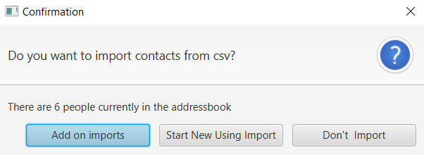
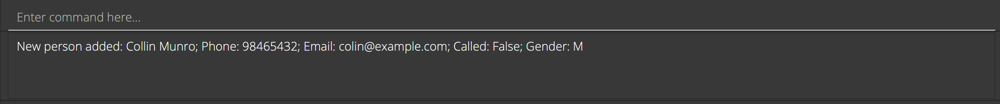
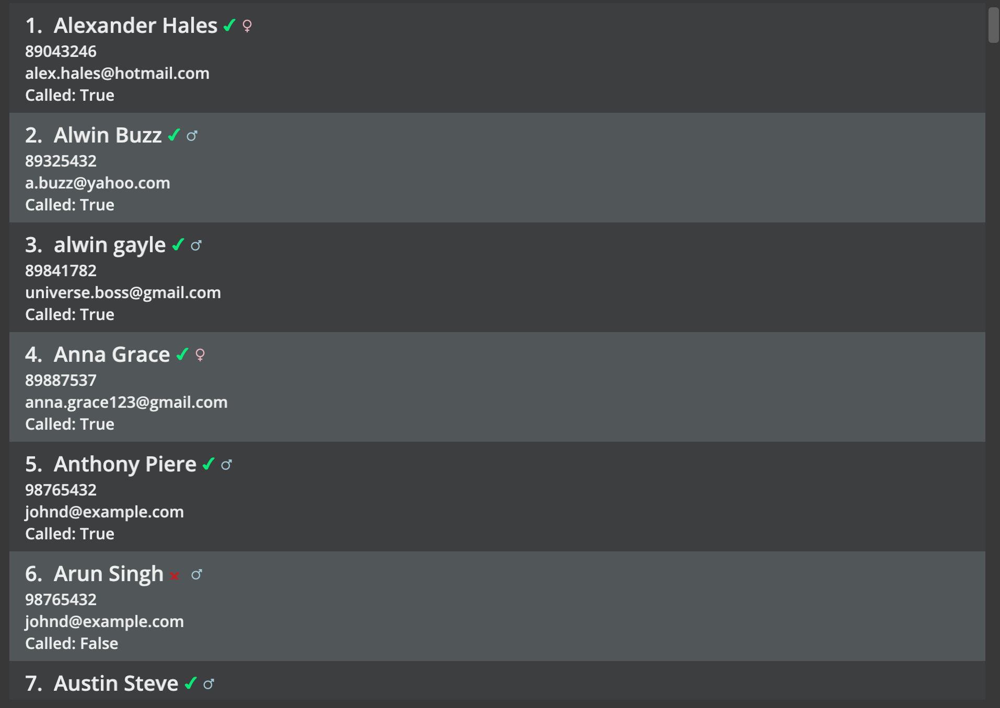
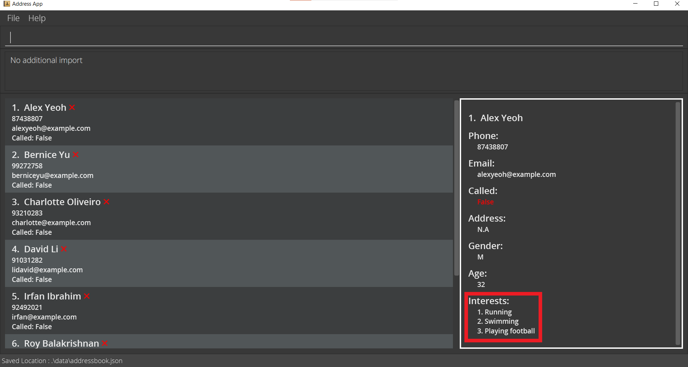
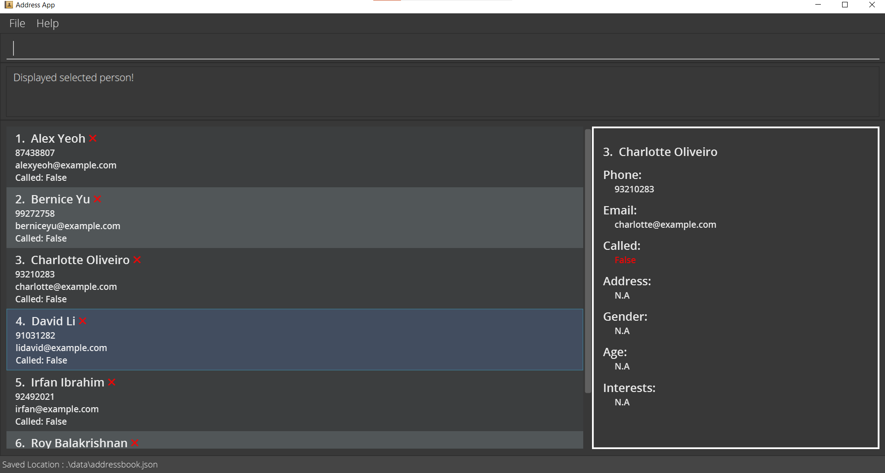
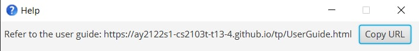
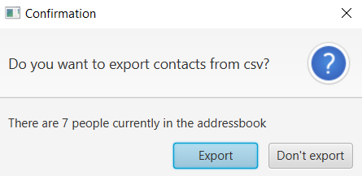

## Introducing CallMeMaybe

CallMeMaybe (CMM) is a **desktop app** that helps Telemarketers in customer contact management.
CMM provides a solution to quickly catalog contacts based on whether they have already been called or not.
The in-built tracking functionality serves as a reminder for you to reach back on previously unreachable customers.
Importing and exporting of existing customer database is also supported by CMM to facilitate team-based environments.

CMM is optimized for use via a **Command Line Interface** (CLI) while still having the benefits of a Graphical User Interface (GUI).

If you can type fast, CMM can get your contact management tasks done faster than traditional GUI apps.

## Navigating the User Guide

This user guide aims to help you easily find the information you desire for any command.  
Each Command section is separated into: 
* Brief description of the command
* Command Format
* Things to note
* Examples
* Common issues

**:information_source: Note:** Straightforward commands such as 'list' may not have the sections "Things to note", "Examples" and "Common issues"

Words and phrases mentioned `like this` refer to code that is to be input by the user. 
It is highly recommended that you familiarise yourself with the [Command Notation details](#3-command-notations) we use.  
If you have not yet downloaded the application, head over to [Quick Start](#2-quick-start) to get started.  
Feel free to check out the [Features](#4-overview-of-features) to check out detailed descriptions of the features offered in our application!  
If you are already an experienced user, feel free to head over to the [Command Summary](#6-command-summary) to get a quick refresher
on the commands.  
If you have any questions about CMM, please refer to the [FAQ](#5-faq).  
Hope you have a great time with CMM.

--------------------------------------------------------------------------------------------------------------------

## 1. Table of Contents
* Table of Contents
{:toc}

--------------------------------------------------------------------------------------------------------------------

## 2. Quick start

1. Ensure you have Java 11 or above installed in your computer

2. Download the latest CallMeMaybe.jar from [here](https://github.com/AY2122S1-CS2103T-T13-4/tp/releases)

3. Copy the file to the folder you want to use as the home folder for CMM

4. Double-click the file to start the app. A prompt will popup asking whether you want to import any new contacts. The prompt will look like the screenshot below :

     
   To learn more about what each option does in detail, click [here](#414-importing-the-data-into-database).
   An example file import can be downloaded [here](https://github.com/AY2122S1-CS2103T-T13-4/tp/releases/tag/Test_Files)

5. After you click any button on the prompt, CMM will execute the selected option, and a GUI similar to the screenshot below should appear in a few seconds. Note how the app contains some sample data upon first startup

   

6. Type the command in the command box and press Enter to execute it. e.g., typing "help" and pressing `Enter` will open the help window
   You can find the commands that CallMeMaybe supports below:
   - `add n/John Doe p/98765432 e/johnd@example.com` : Adds a contact named John Doe to the CMM database
   - `list` : Lists all contacts
   - `called 2` : Marks the 2nd contact shown in the current list as called
   - `edit 1 n/Bob p/62353535` : Edits the name and phone number of the first contact in the displayed list
   - `findAny n/alex g/m` : Finds the contacts that have the substring `alex`in their name **AND/OR** are males
   - `findAll n/alex g/m` : Finds the contacts that have both the substring `alex` in their name **AND** are males
   - `delete 3` : Deletes the 3rd contact shown in the current list
   - `display 4` : Displays the full contact details of the fourth contact in the displayed list
   - `filter called` : Sorts the list to display uncalled contacts first
   - `clear` : Deletes all contacts
   - `exit` : Exits the app

7. Remember to clear the sample data using `clear` command before adding your own data

8. Refer to the [Features](#4-overview-of-features) below for details of each command

--------------------------------------------------------------------------------------------------------------------

## 3. Interface layout

**Command Panel**

*Image of CMM's Command Panel*

* User commands are entered in the Command Line (section labeled `Enter command here...`)
* The Feedback Box (the bottom section) displays the result of the command, which can be an error message if the command is invalid

**Display List**

*Image of CMM's Display List*

* Displays the list of contacts along with their contact details which includes the name, phone number, email address and isCalled attributes

**Person Card**

*Image of CMM's Person Card*

* Displays additional information of each contact in the list of contacts. This includes the attributes age, gender, address and interests
* When application is started, the first contact in the list is displayed. If the contact list is empty, then CMM displays an example
  contact with example attributes. The example is purely visual, and doesn't exist in the actual contact list.

--------------------------------------------------------------------------------------------------------------------

## 4. Command Notations

**:information_source: Notes about the command format:** 

* Words in `UPPER_CASE` are the parameters to be supplied by the user. 
  e.g., in `add n/NAME`, `NAME` is a parameter which can be used as `add n/John Doe`.

* Items in square brackets are optional. 
  e.g., `n/NAME [g/GENDER]` can be used as `n/John Doe g/M` or as `n/John Doe`.

* Items with `…`​ after them can be used multiple times including zero times. 
  e.g., `[i/INTEREST]…​` can be used as ` ` (i.e., 0 times), `i/running`, `i/running i/watching tv` etc.

* Parameters can be in any order. 
  e.g., if the command specifies `n/NAME p/PHONE_NUMBER`, `p/PHONE_NUMBER n/NAME` is also acceptable.

* If a parameter is expected only once in the command is specified multiple times, only the last occurrence of the parameter will be taken. 
  e.g., if you specify `p/99998888 p/66667777`, only `p/66667777` will be taken.

* Extraneous parameters for commands that do not take in parameters (such as `help`, `list`, `exit` and `clear`) will be ignored. 
  e.g., if the command specifies `help 123`, it will be interpreted as `help`.

## 5. Overview of Features

### 5.1 Adding a contact: `add`

Adds a contact to the CMM database.

Format: `add n/NAME p/PHONE_NUMBER e/EMAIL [a/ADDRESS] [g/GENDER] [age/AGE] [i/INTEREST]…​`

**Things to note:**
* `Name`, `Phone_number` and `Email` fields are mandatory
* `Name` must contain only alphanumeric characters
* `Phone_number` must contain exactly 8 digits
  * numbers must start with "6", "8" or "9"
* `Email` should be in the form of `local-part@domain-name`  
  * The local-part should only contain alphanumeric characters and these special characters, `+_.-`  
  * The local-part may not start or end with any special characters. 
  * The domain-name is made up of domain labels separated by periods. (eg. @nus.edu.sg) 
  * The domain-name must end with a domain label at least 2 characters long 
  * The domain-name must have each domain label start and end with alphanumeric characters 
  * The domain-name must have each domain label consist of alphanumeric characters, separated only by hyphens, if any 
* `Gender` can only be "m", "f", "n.a" (case-insensitive)
* `Age` must only contain numbers
* `Address` and `Interest` can be in any format
*  All the fields are case-insensitive  

:bulb: 

**Tip:**  
`Address`, `Gender`, `Age`, `Interest` fields are optional. A contact can have multiple interests.

Examples:
* `add n/John Doe p/98765432 e/johnd@example.com` Adds a contact with the following fields:
    * `Name`: John Doe
    * `Phone`: 98765432
    * `Email`: johnd@example.com
    * All other unspecified fields will be set to N.A by default
* `add n/Betsy Crowe p/92345679 e/betsycrowe@example.com a/her house i/running i/swimming i/eating`
    * `Name`: Betsy Crowe
    * `Phone`: 92345679
    * `Email`: betsycrowe@example.com
    * `Address`: her house
    * `Intrests`: running, swimming, eating
    * All other unspecified fields will be set to N.A by default

**Common issues:**
* _Invalid command format!_:  
  a. Omitted one or more of the mandatory fields  
  b. Used the wrong prefix (e.g., '/n' instead of 'n/')  

### 5.2 Listing all contacts : `list`

Shows a list of all contacts in the CMM database.

Format: `list`

**Things to note:**
* `list` shows all contacts in ascending order by name

### 5.3 Marking a contact as called : `called`

Marks the specified contact from the address book as called. (i.e., contact has already been called)

Format: `called INDEX`

Example:
* `called 3` marks the 3rd contact in the displayed list as Called

**Things to note:**

* `INDEX` refers to the index number shown in the displayed list
* `INDEX` **must be a positive integer** (e.g., 1, 2, 3, …​)
*  If you want to un-call a contact, use the [edit command](#44-editing-a-contact--edit)

**Common issues:**
* _The index provided is invalid_:  
  a. Displayed list does not contain contact at `INDEX`  
  b. Index specified is larger than 2147483647  
  c. Index specified is not a positive integer  

### 5.4 Editing a contact : `edit`

Edits an existing contact in the CMM database.

Format: `edit INDEX [n/NAME] [p/PHONE] [e/EMAIL] [a/ADDRESS] [g/GENDER] [age/AGE] [c/CALLED] [i/(OPTIONAL INTERESTSLIST INDEX) INTEREST]...
[i/(INTERESTSLIST INDEX) remove]... [i/INTEREST]..`

:bulb: 

**Tip:**  
Specifying (INTERESTLIST INDEX) is optional as well.  
If (INTERESTLIST INDEX) is specified, the interest at that index would be updated.  
If it is not, then an interest would be added to the list instead.  
You can refer to the examples below for a better understanding of the edit command functionality.

Examples:
* `edit 1 n/Malan i/Painting i/(2) Swimming` Edits the following fields of the **first contact in the displayed list** : 
    * Edit `Name` to 'Malan'
    * Adds 'painting' as a *new* `Interest`
    * Edits the **second** `Interest` to 'Swimming'

* `edit 2 g/M e/myEmail@email.com age/55` Edits the following fields of the **second contact in the displayed list** : 
    * Edits the `Gender` to 'M'
    * Edits `Email` to 'myEmail@email.com'
    * Edits `Age` to '55'

* `edit 3 i/(1) eat i/(2) remove` Edits the following fields of the **third contact in the displayed list** : 
    * Edits the **first** `Interest` to 'eat'
    * Removes the second `Interest`

**Things to note:**

* `INDEX` refers to the index number shown in the displayed list
* `INDEX` **must be a positive integer** (e.g., 1, 2, 3, …​)
* `INTERESTSLIST INDEX` refers to the index number shown in the displayed interests list of the contact
* `INTERESTSLIST INDEX` **must be a positive integer** (e.g., 1, 2, 3, …​)
  * The Interests list of a contact can be found here (refer to the screenshot below) and can be displayed by using the [display command](#48-displaying-full-contact-details--display)

     
* All the fields are case-insensitive

**Common issues:**
* _The index provided is invalid_:  
  a. Displayed list does not contain contact at `INDEX`

* _The interests list index provided is invalid_:  
  a. Displayed interests list does not contain an interest at `INTERESTSLIST INDEX`

* _Invalid command format!_:  
  a. No fields provided  
  b. Used the wrong prefix. (e.g., 'i/[1]' instead of 'i/(1)')  

* _Invalid command arguments_:  
    a. Duplicate of the edited contact already exists on the address book  

### 5.5 Deleting a contact : `delete`

Deletes the specified contact from the CMM database.

Format: `delete INDEX`

Example:
* `delete 2` deletes the *second contact in the displayed list*

:exclamation: 

**Caution:** Deleting is irreversible, please use with caution.

**Things to note:**
* `INDEX` refers to the index number shown in the displayed contacts list
* `INDEX` **must be a positive integer** (e.g., 1, 2, 3, …​)

**Common issues:**
* _The index provided is invalid_:  
  a. Displayed list does not contain contact at `INDEX`  
  b. Index specified is larger than 2147483647  
  c. Index specified is not a positive integer  

### 5.6 Finding contacts that match **ANY** of the keywords specified: `findAny`

Format: `findAny [n/NAME…​] [p/PHONE…​] [e/EMAIL…​] [a/ADDRESS…​] [g/GENDER…​] [age/AGE…​]
[c/CALLED…​] [i/INTEREST…​]`

**Things to note:**
* FindAny requires at least one field. But it is optional to include all the fields  
* If there are duplicate fields, CMM will only take the right-most field  
eg. `findAny n/alex n/david` returns the same results as `findAny n/david`
* The search is case-insensitive. e.g `n/hans` will return the same result `n/Hans`  
* Any number of keywords can be specified within each field  
* The order of the keywords within each field does not matter. e.g., `n/Hans Bo` will return the same result
  as `n/Bo Hans` 
* Keywords for `Called` are limited to `true`, `false`, `t`, `f`
* Keywords for `Gender` are limited to `male`, `female`, `m`, `f`
* All the fields are case-insensitive
* You can refer to the examples below for a better understanding

:bulb: 

**Tip:**  
findAll vs findAny 
`findAll` searches for contacts that satisfy **ALL** the fields specified. 
`findAny` searches for contacts that satisfy **ANY** of the fields specified. 

Click [here](#47-finding-contacts-that-match-all-the-keywords-specified--findall) to learn more about findAll

Examples:
* `findAny n/John` finds all contacts that have the substring `john` in their name
* `findAny n/alex david` finds all contacts that have either the substring 'alex' or 'david' in their name 
* `findAny n/alex david a/woodlands` finds all contacts that have either the substring 'alex' or 'david' in their name or
have the substring 'woodlands' in their address
* `findAny n/alex n/david` only finds all contacts that have the substring 'david' in their name

**Common issues:**
* _Unknown command_:  
  a. Using `findany` instead of `findAny` (not capitalising the 'A')

* _Invalid command format!_:  
  a. No fields provided 
  b. Used the wrong prefix (eg. '/n' instead of 'n/')  
  c. Did not specify either 't', 'f', 'true', 'false' after `c/`  
  d. Did not specify either 'm', 'f', 'male', 'female', 'n.a' after `g/`  

### 5.7 Finding contacts that match **ALL** the keywords specified : `findAll`

Format: `findAll [n/NAME…​] [p/PHONE…​] [e/EMAIL…​] [a/ADDRESS…​] [g/GENDER…​] [age/AGE…​] [c/CALLED…​] [i/INTEREST…​]`

**Things to note:**
* `findAll` only returns contacts that matches all the keywords specified in their respective fields
* `findAll` requires at least one field. But it is optional to include all the fields.  
* If there are duplicate fields, CMM will only take the right-most field  
  e.g., `findAll n/alex n/david` returns the same results as `findAny n/david`
* The search is case-insensitive. e.g., `n/hans` will return the same result `n/Hans`  
* Any number of keywords can be specified within each field  
* The order of the keywords within each field does not matter. e.g., `n/Hans Bo` will return the same result
  as `n/Bo Hans` 
* Keywords for `Called` are limited to `true`, `false`, `t`, `f`
* Keywords for `Gender` are limited to `male`, `female`, `m`, `f`
* All the fields are case-insensitive
* You can refer to the examples below for a better understanding

:bulb: 

**Tip:**  
findAll vs findAny:  
`findAll` searches for contacts that satisfy **ALL** the fields specified. 
`findAny` searches for contacts that satisfy **ANY** of the fields specified. 

Click [here](#46-finding-contacts-that-match-any-of-the-keywords-specified-findany) to learn more about findAny

Examples:
* `findAll n/alex` finds all the contacts that have the substring 'alex' in their name
* `findAll n/Malan i/Swimming` finds only the contacts that have **BOTH** the substring 'Malan' in the name and the substring 'swimming' as their interests
* `findAll i/Painting i/ Running` finds only the contacts that have 'running' as a substring as their interests
* `findAll n/al da vi a/ho oh` finds only the contacts that have **ALL 3** substrings of 'al', 'da' and 'vi' in their name **AND both** substrings of 'ho' and 'oh' in the address

**Common issues:**
* _Unknown command_:  
  a. Using `findany` instead of `findAny` (not capitalising the 'A')

* _Invalid command format!_:  
  a. No fields provided 
  b. Used the wrong prefix (e.g., '/n' instead of 'n/')  
  c. Did not specify either 't', 'f', 'true', 'false' after `c/`  
  d. Did not specify either 'm', 'f', 'male', 'female', 'n.a' after `g/`  

### 5.8 Displaying full contact details : `display`

Displays additional information of a particular contact stored in the application. These include the
address, gender, age and their interests.

The full details of the contact are shown on the right side of the application (inside the white box).

Format: `display INDEX`

Example:
* `display 3` displays full contact details of the 3rd contact in the displayed list

**Common issues:**
* _The index provided is invalid_:  
  a. Displayed list does not contain contact at `INDEX`  
  b. Index specified is larger than 2147483647  
  c. Index specified is not a positive integer  

### 5.9 Filtering contacts : `filter`

Filters the existing contacts in the CMM database. The displayed list will show contacts sorted by the chosen category.

Format: `filter CATEGORY [COUNT]`

**Things to note:**
* `CATEGORY` field is mandatory
* `CATEGORY` refers to the category used to filter the contacts
* `CATEGORY` **must be one of the following:** called, gender
* `COUNT` refers to the number of contacts to be shown in the displayed list. If `COUNT` is more than the total number
  of contacts, all contacts will be shown
* `COUNT` **must be a positive integer less than 2147483648** (e.g., 1, 2, 3, …, 2147483647 ​)
* If more arguments are given than what is required, the last two arguments are taken into account
  (e.g., `filter gender called 2` will be interpreted as `filter called 2`)
* If the last argument is not an integer, it will be interpreted as a `CATEGORY`
  (e.g., `filter gender called` will be interpreted as `filter called`)
* If more than one category is entered, the last category will be interpreted as the `CATEGORY`
  (e.g., `filter gender called 3` will be interpreted as `filter called 3`)
* If only one argument is given, it will be interpreted as a `CATEGORY`
  (e.g., `filter 1000` will cause `1000` to be interpreted as a `CATEGORY`)

Examples:
* `filter called` filters the displayed list to show uncalled contacts first
* `filter called 2` filters the displayed list to show uncalled contacts first and to only show the first two contacts
* `filter gender 3` filters the displayed list to show female contacts first and to only show the first three contacts

**Common issues:**
* _Invalid command format!_:  
  a. No fields provided  

* _Category can only be either "called" or "gender"_:  
  a. The category specified is not `called` or `gender`  
  b. Category not specified

* _Count is not a non-zero unsigned integer. It cannot be bigger than 2147483647 (i.e., MAX_VALUE)_:  
  a. The last argument is not a positive integer  
  b. The last argument is bigger than 2147483647  

### 5.10 Clearing all contacts : `clear`

Clears all contacts from the CMM database.

Format: `clear`

:exclamation: 

**Caution:** 
Clearing is irreversible, please use with caution.

### 5.11 Viewing help : `help`

Shows a message explaining how to access the User Guide.

Format: `help`

### 5.12 Exiting the program : `exit`

Exits the program.

Format: `exit`

### 5.13 Saving the data

CMM data are saved in the hard disk automatically after any command that changes the data. There is no need to save manually.

### 5.14 Importing the data into database

CMM is able to import Excel files into CMM. The import files have to be in an Excel Csv format (semicolon delimited).

**Steps to Import from Excel file**
1. Ensure that the Excel file is a CSV file type that is **semicolon delimited**
   Instructions on how to import to this file type can be found [here](SettingImportFileType.md)
2. Ensure that the import file is named import.csv under the "data" folder found in the same directory as the CMM jar file
3. Upon CMM application startup, a prompt will popup with 3 options : `Add On Imports`, `Start New Using Import`, `Don't Import`. The popup will look like the image below:

**Import options**

`Add On Imports`
- Adds on new imports into existing database

`Start New Using Import`
- Exports and reset the current database. CMM will then populate the reset database with new imports
- Previous database **before import** can be found in a CSV file under the "data" folder found in the same directory as the CMM jar file. It will have the following file name : `export[Date HH:MM:SS].csv`

`Don't Import`
- CMM will not import anything and application will startup normally
- Closing the prompt will also choose this option

:exclamation:

**Caution:** 
Currently, import is **irreversible**. Please double check before importing. This is especially important when choosing the add on import option.

**Things to note**
* CMM will prompt user for imports upon **every** application startup
* CMM will not import data rows with missing details (Compulsory for data to have `name`, `phone`, `email` filled)
* CMM will treat two people with the exact `name`, `phone`, `email`  as duplicates
* CMM will update duplicate imports **only when** import status has been called
* Import is only allowed during application startup. To import after the startup, simply reopen application to get the import prompt
* Unsuccessful file import will result in an empty database. The previous database can be recovered in the latest export file

**Common Issues**
* _CSV file not found in data\import.csv_ 
    * This could either mean that the file **does not exist** at the specified location or  
    * The file was **incorrectly named**. File has to be named `import.csv`
* _Missing/Extra Headers, Please check file_ 
   * **Files has invalid headers**  
        * First row of Excel file is reserved for datatype headers.  
        * Headers must include `Name`, `Phone`, `Email`, `Address`, `Gender`, `Age`, `Interest` and `Called` from the left to right, starting from the cell 'A1'  
        * Headers are not case-sensitive 
    * File may have **incorrect CSV type**. Please refer to this [guide](SettingImportFileType.md)
   to correctly format your file.
* _Wrong header detected,please double check file_ 
    * **Files has invalid headers**. Please refer to Common issue `Missing/Extra Headers, Please check file` to resolve
* Data not imported despite **correct import file placement, naming AND headers**  
    * File may not be in the correct CSV type. Please refer to this [guide](SettingImportFileType.md)
         to correctly format your file.
* Unable to understand why a specific row was not able to be imported  
    * Row could either be duplicate or there was an error reading the row
    * Detailed reasons for any import error can be found in the logs of the CMM

:bulb: 

**Tip:**  
An example file import can be downloaded [here](https://github.com/AY2122S1-CS2103T-T13-4/tp/releases/tag/Test_Files)

    
### 5.15 Exporting state of database

CMM is able to export the current database as semicolon delimited CSV files. As such, there is no need for you to ensure that the formatting is right for furture use.

**Steps to Export data as CSV file**
1. Closing the application in any way would prompt user to export the current database  

2. The CMM will export the database to the data file location
3. Export file will have the following file name : `export[Date HH:MM:SS].csv` where date and time will follow your system settings

:bulb: 

**Tip:**  
Csv file can be found under the "data" folder found in the same directory as the CMM jar file.

### 5.16 Editing the data file (JSON)

AddressBook data are saved as a JSON file `[JAR file location]/data/addressbook.json`. Advanced users are welcome to update data directly by editing that data file.

:exclamation: 

**Caution:** 
If your changes to the data file makes its format invalid, AddressBook will discard all data and start with an empty data file at the next run.

--------------------------------------------------------------------------------------------------------------------

## 6. FAQ

**Q**: How do I transfer my data to another Computer? 
**A**: Install the app in the other computer and overwrite the empty data file it creates with the file that contains the data of your previous AddressBook home folder. Data found can be found at `[JAR file location]/data/addressbook.json`.
--------------------------------------------------------------------------------------------------------------------

## 7. Command summary

Action | Format, Examples
--------|------------------
**Add** | `add n/NAME p/PHONE_NUMBER e/EMAIL [a/ADDRESS] [g/GENDER] [age/AGE] [i/INTEREST]…​`   e.g., `add n/Labuschagne Ho p/22224444 e/labuschagne@example.com a/my house g/F age/95 i/Sleeping`
**List** | `list`
**Called** | `called INDEX`   e.g., `called 2`
**Edit** | `edit INDEX [n/NAME] [p/PHONE] [e/EMAIL] [a/ADDRESS] [g/GENDER] [age/AGE] [c/CALLED] [i/(OPTIONAL INTERESTSLIST INDEX) INTEREST]... [i/(INTERESTSLIST INDEX) remove]... [i/INTEREST]...`   e.g., `edit 1 n/Bob p/68889444 e/email@email.com a/his house g/M age/33 i/Eating i/(2) Swimming`
**Delete** | `delete INDEX`  e.g., `delete 3`
**FindAny** | `findAny [n/NAME…​] [p/PHONE…​] [e/EMAIL…​] [a/ADDRESS…​] [g/GENDER…​] [age/AGE…​] [d/DONE…​] [i/INTEREST…​]`  e.g., `findAny n/alex g/m`
**FindAll** | `findAll [n/NAME…​] [p/PHONE…​] [e/EMAIL…​] [a/ADDRESS…​] [g/GENDER…​] [age/AGE…​] [d/DONE…​] [i/INTEREST…​]`  e.g., `findAll n/alex g/m`
**Display** | `display INDEX`   e.g., `display 4`
**Filter** | `filter CATEGORY [COUNT]`   e.g., `filter gender 5`
**Clear** | `clear`
**Exit** | `exit`
**Help** | `help`

Thank you for reading the User Guide. Hope you have a pleasant experience with CallMeMaybe.

